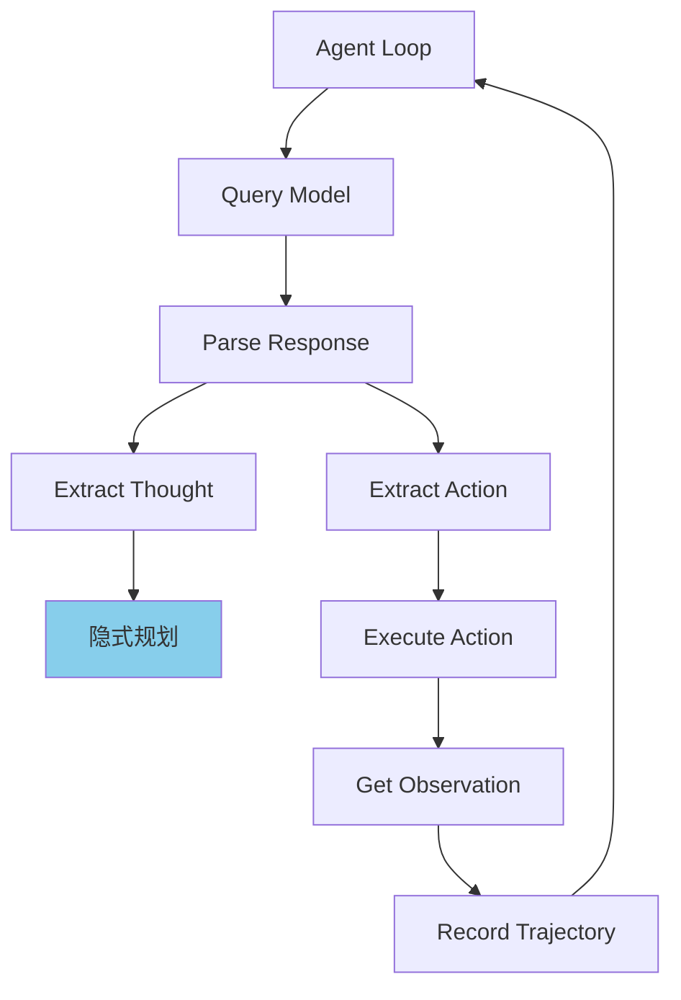
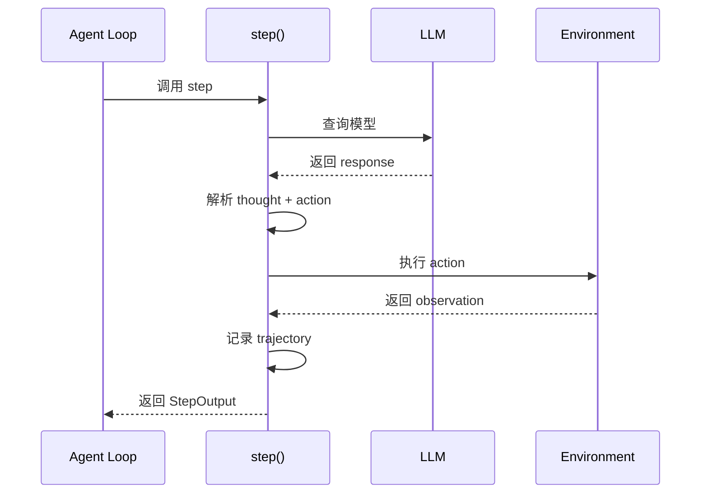
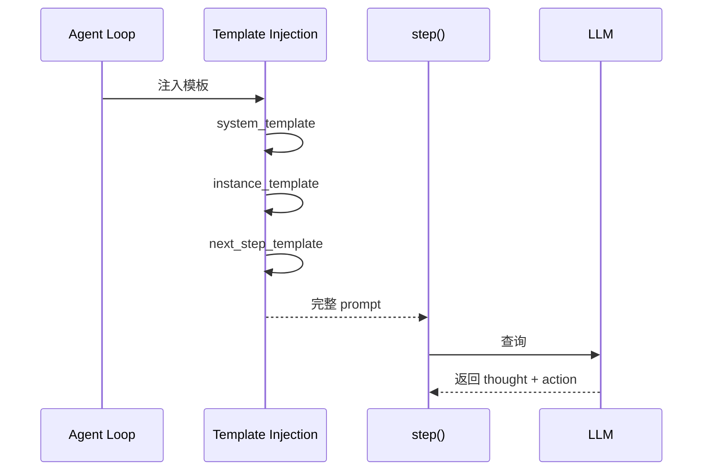
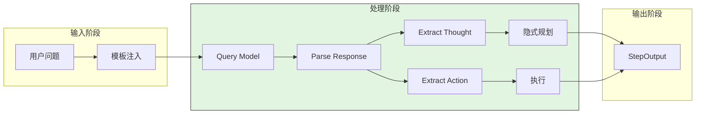

# SWE-agent Plan and Execute

## TL;DR（结论先行）

SWE-agent **没有实现专门的 "plan and execute" 模式**。它采用**统一的 thought-action 循环**架构，将规划和执行集成在单个步骤中。核心取舍是**简化架构**（对比 Codex/Gemini CLI 的显式模式切换）。

---

## 1. 为什么需要这个机制？

### 1.1 问题场景

Plan-and-Execute 模式试图解决：
- 复杂任务需要预先规划
- 执行前需要用户确认计划
- 规划阶段需要限制工具使用

SWE-agent 的设计选择：
- 软件工程任务往往需要边探索边调整
- 预先制定完整计划困难且容易过时
- 每步都重新规划更灵活

### 1.2 核心挑战

| 挑战 | Plan-and-Execute | Thought-Action |
|-----|------------------|----------------|
| 任务适应性 | 适合预定义流程 | 适合探索性任务 |
| 用户交互 | 需要确认环节 | 自主执行 |
| 架构复杂度 | 需要模式切换 | 简单统一 |
| 灵活性 | 计划变更成本高 | 每步可调整 |

---

## 2. 整体架构

### 2.1 SWE-agent 架构

```text
┌─────────────────────────────────────────────────────────────┐
│ SWE-agent Thought-Action Loop                                │
│ sweagent/agent/agents.py                                     │
└───────────────────────┬─────────────────────────────────────┘
                        │
                        ▼
┌─────────────────────────────────────────────────────────────┐
│ Step = Thought + Action + Observation                        │
│ - 无显式阶段分离                                            │
│ - 规划发生在每个 step 内部                                  │
│ - 模板提供程序性指导                                        │
└─────────────────────────────────────────────────────────────┘
```

### 2.2 对比：Plan-and-Execute 架构

```text
┌─────────────────────────────────────────────────────────────┐
│ Traditional Plan-and-Execute                                 │
├─────────────────────────────────────────────────────────────┤
│                                                              │
│   ┌──────────┐      ┌──────────┐      ┌──────────┐         │
│   │   Plan   │ ───▶ │  Confirm │ ───▶ │ Execute  │         │
│   │   Phase  │      │  by User │      │  Phase   │         │
│   └──────────┘      └──────────┘      └──────────┘         │
│                                                              │
│   特点：                                                      │
│   • 显式的阶段分离                                           │
│   • Plan 阶段禁止执行                                        │
│   • 用户确认后进入执行                                        │
│                                                              │
└─────────────────────────────────────────────────────────────┘
```

---

## 3. 核心组件详细分析

### 3.1 Thought-Action 循环

#### 职责定位

每个步骤包含完整的 thought-action-observation 周期。

#### 关键算法逻辑



---

### 3.2 ThoughtActionParser

#### 职责定位

解析模型响应，提取 thought 和 action。

#### 内部数据流

```text
┌─────────────────────────────────────────────────────────────┐
│  ThoughtActionParser                                         │
│  ├── 输入: 模型响应文本                                      │
│  ├── 解析: thought（自由文本）                               │
│  ├── 解析: action（代码块）                                  │
│  └── 输出: (thought, action) 元组                            │
│                                                              │
│  错误模板明确要求模型：                                       │
│  "Discuss here with yourself about what your planning"       │
└─────────────────────────────────────────────────────────────┘
```

---

## 4. 端到端数据流转

### 4.1 正常流程



### 4.2 模板驱动流程



### 4.3 数据流向图



---

## 5. 关键代码实现

### 5.1 核心数据结构

```python
# sweagent/agent/agents.py
class TemplateConfig(BaseModel):
    """模板配置"""
    system_template: str = ""
    instance_template: str = ""
    next_step_template: str = "Observation: {{observation}}"
    strategy_template: str | None = None
    demonstration_template: str | None = None
```

**字段说明**：

| 字段 | 类型 | 用途 |
|-----|------|------|
| `system_template` | `str` | 系统身份定义 |
| `instance_template` | `str` | 问题实例描述 |
| `next_step_template` | `str` | 下一步指导 |
| `strategy_template` | `str | None` | 战略规划（可选） |

### 5.2 主链路代码

```python
# sweagent/agent/agents.py
def step(self) -> StepOutput:
    """Single step of the agent: query model, extract thought/action, execute."""
    # 1. 查询模型
    response = self.forward_with_handling()

    # 2. 提取 thought 和 action
    thought, action = self.parse_response(response)

    # 3. 执行 action
    observation = self.execute_action(action)

    # 4. 记录轨迹
    self.trajectory.add_step(thought, action, observation)

    return StepOutput(thought=thought, action=action, observation=observation)

def run(self, env, problem_statement, output_dir) -> AgentRunResult:
    """Run the agent on a problem instance."""
    self.setup(env=env, problem_statement=problem_statement, output_dir=output_dir)

    # Run action/observation loop
    step_output = StepOutput()
    while not step_output.done:
        step_output = self.step()  # 单步 thought+action+observation
        self.save_trajectory()
```

**代码要点**：

1. **统一循环**：无阶段分离，每个迭代执行完整周期
2. **隐式规划**：规划发生在每个 step 内部
3. **模板引导**：通过模板提供程序性指导

### 5.3 关键调用链

```text
Agent.run()                          [SWE-agent/sweagent/agent/agents.py:390]
  -> step()                          [SWE-agent/sweagent/agent/agents.py:790]
    -> forward_with_handling()       [SWE-agent/sweagent/agent/agents.py:1062]
      - 模型调用
    -> parse_response()              [SWE-agent/sweagent/agent/agents.py:790]
      -> ThoughtActionParser()       [SWE-agent/sweagent/tools/parsing.py]
    -> execute_action()              [sweagent/agent/agents.py:300]
      - 执行工具
```

---

## 6. 设计意图与 Trade-off

### 6.1 SWE-agent 的选择

| 维度 | SWE-agent 的选择 | 替代方案 | 取舍分析 |
|-----|-----------------|---------|---------|
| 架构模式 | Thought-Action | Plan-and-Execute | 简单灵活，适合探索 |
| 规划时机 | 每步规划 | 预规划 | 适应新信息，但可能重复 |
| 用户确认 | 无 | 有 | 自主执行，适合自动化 |
| 工具权限 | 无限制 | Plan 阶段限制 | 灵活但需更多监督 |

### 6.2 为什么这样设计？

**核心问题**：软件工程任务是否需要显式的 Plan-and-Execute？

**SWE-agent 的解决方案**：
- 代码依据：`sweagent/agent/agents.py:step()`
- 设计意图：简化架构，专注探索性任务
- 带来的好处：
  - 架构简单，易于实现和维护
  - 每步都可调整策略
  - 适合边探索边调整的软件工程任务
- 付出的代价：
  - 缺乏系统性规划
  - 可能遗漏关键步骤
  - 无用户确认环节

### 6.3 与其他项目的对比

| 项目 | 核心差异 | 适用场景 |
|-----|---------|---------|
| SWE-agent | Thought-Action 循环 | Bug 修复、探索性重构 |
| Codex | 显式 Plan/Execute 模式 | 需求明确的大型功能 |
| Gemini CLI | ApprovalMode 状态机 | 需要用户确认的场景 |

---

## 7. 边界情况与错误处理

### 7.1 终止条件

| 终止原因 | 触发条件 | 代码位置 |
|---------|---------|---------|
| 任务完成 | step_output.done = True | `sweagent/agent/agents.py` |
| 重试耗尽 | n_format_fails >= max_requeries | `SWE-agent/sweagent/agent/agents.py:1211` |
| 上下文溢出 | ContextWindowExceededError | `SWE-agent/sweagent/agent/agents.py:1175` |

### 7.2 错误恢复策略

| 错误类型 | 处理策略 | 代码位置 |
|---------|---------|---------|
| FormatError | 模板反馈 + 重试 | `sweagent/agent/agents.py:1153` |
| 解析失败 | 错误模板提示 | `sweagent/tools/parsing.py` |

---

## 8. 关键代码索引

| 功能 | 文件 | 行号 | 说明 |
|-----|------|------|------|
| Agent Loop | `SWE-agent/sweagent/agent/agents.py` | 390 | run() 主循环 |
| Step 实现 | `SWE-agent/sweagent/agent/agents.py` | 790 | step() thought-action |
| 模板配置 | `SWE-agent/sweagent/agent/agents.py` | 60 | TemplateConfig |
| 响应解析 | `SWE-agent/sweagent/tools/parsing.py` | - | ThoughtActionParser |

---

## 9. 延伸阅读

- 前置知识：`docs/swe-agent/04-swe-agent-agent-loop.md`（Agent 循环详细分析）
- 相关机制：`docs/swe-agent/11-swe-agent-prompt-organization.md`（模板系统）
- 对比分析：`docs/codex/04-codex-agent-loop.md`（Codex 的 Plan-and-Execute 实现）

---

*✅ Verified: 基于 sweagent/agent/agents.py、sweagent/tools/parsing.py 等源码分析*
*基于版本：SWE-agent (baseline 2026-02-08) | 最后更新：2026-02-25*
