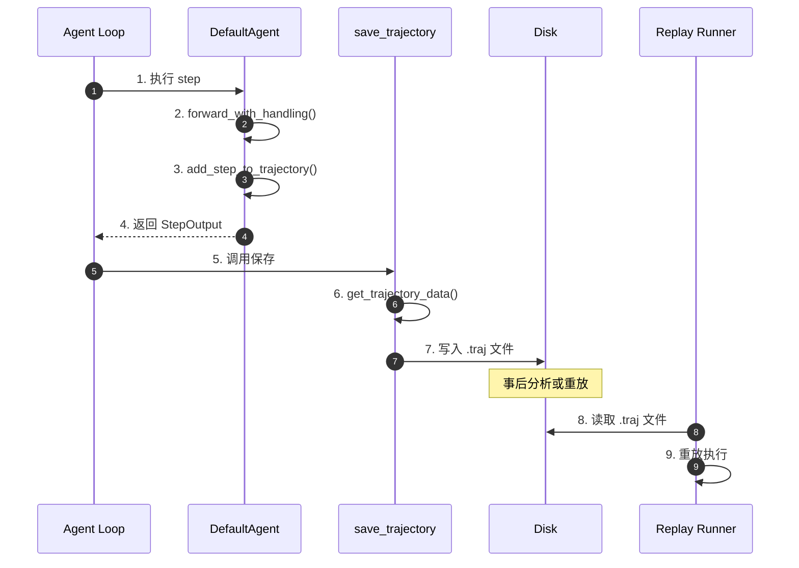
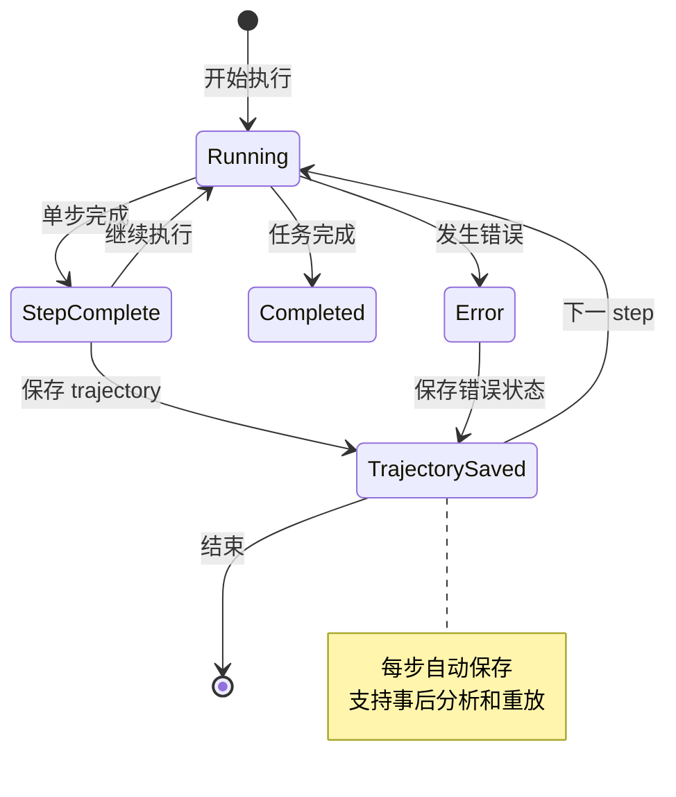
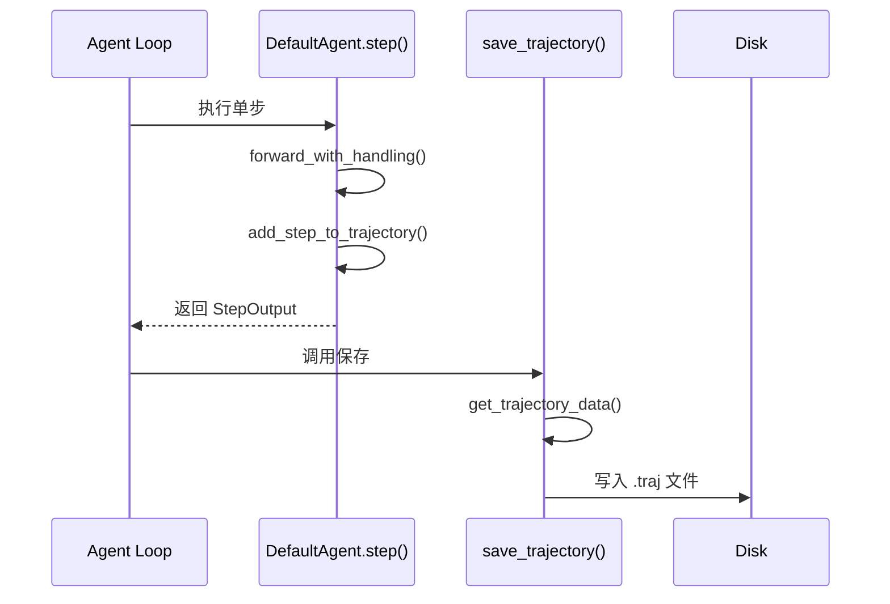
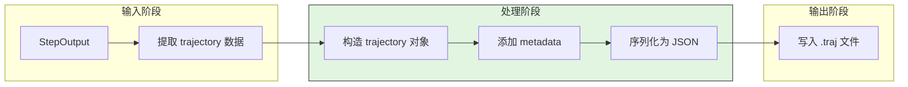
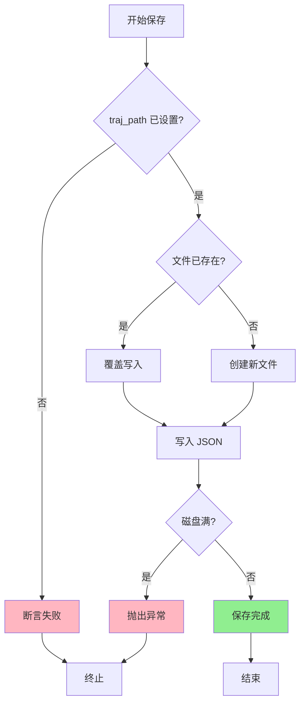
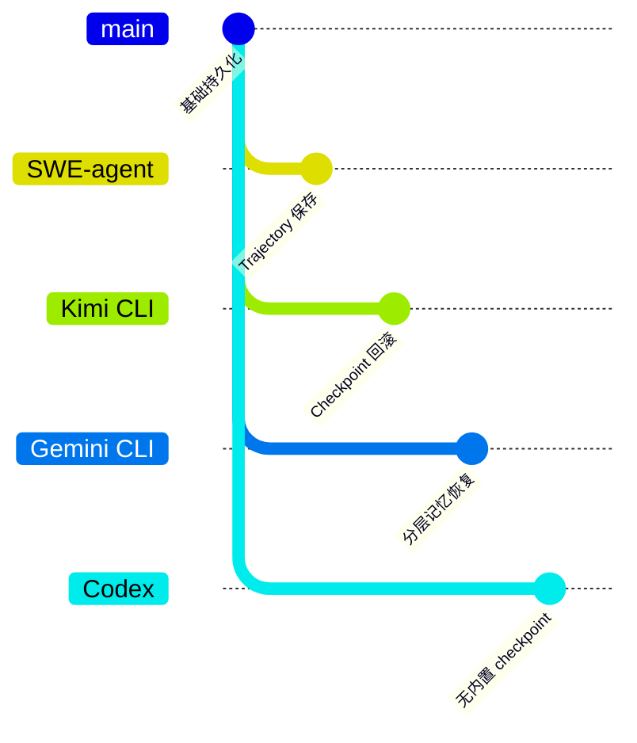

# SWE-agent Revert User Edit Conflict

> **阅读指南**
>
> | 属性 | 说明 |
> |-----|------|
> | 预计阅读 | 15-20 分钟 |
> | 前置文档 | `docs/swe-agent/02-swe-agent-session-management.md`、`docs/swe-agent/04-swe-agent-agent-loop.md` |
> | 文档结构 | 结论 → 架构 → 组件分析 → 数据流 → 代码实现 → 对比 |
> | 代码呈现 | 关键代码直接展示，完整代码可折叠查看 |

---

## TL;DR（结论先行）

**SWE-agent 的 checkpoint 仅用于"每步持久化、断点续传"，未实现用户可触发的文件级 revert/rollback 能力。** 因此"revert 时发现用户已编辑与源文件冲突"的文件冲突场景，在现有架构中不适用；无对应冲突检测或协商逻辑。

SWE-agent 的核心取舍：**简化持久化，专注自动化**（对比 Kimi CLI 的 Checkpoint 回滚、Gemini CLI 的分层记忆恢复）

### 核心要点速览

| 维度 | 关键决策 | 代码位置 |
|-----|---------|---------|
| 持久化目的 | 断点续传和事后分析，非用户交互 | `sweagent/agent/agents.py:779` |
| 保存粒度 | 每 step 保存完整 trajectory | `sweagent/agent/agents.py:1286` |
| 文件格式 | JSON，便于阅读和解析 | `sweagent/agent/agents.py:787` |
| 恢复能力 | 支持从 trajectory 重放 | `sweagent/run/run_replay.py` |
| 用户回滚 | ❌ 不支持 | - |

---

## 1. 为什么需要这个机制？

### 1.1 问题场景

在支持 revert 的系统中（如 Kimi CLI），可能出现以下场景：
- 用户手动编辑文件后触发 revert
- revert 操作与用户的编辑产生冲突
- 需要冲突检测和协商机制

SWE-agent 的现状：
- Checkpoint 仅用于内部持久化（trajectory 保存）
- 无用户触发的文件级 revert
- 因此不存在上述冲突场景

```
Kimi CLI 的 Checkpoint 回滚场景：
  → Step 10: Agent 修改了 file.py
  → 用户手动编辑 file.py（添加新功能）
  → 用户触发 revert 到 Step 9
  → 冲突检测：file.py 在 Step 10 后已被修改
  → 协商策略：用户选择保留/覆盖/合并

SWE-agent 的 Trajectory 场景：
  → Step 10: Agent 修改了 file.py
  → Trajectory 自动保存到 .traj 文件
  → 无用户交互，无 revert 功能
  → 任务结束后可重放 trajectory 分析
  → 支持从任意 step 恢复执行（非用户触发）
```

### 1.2 核心挑战

| 挑战 | 假设支持 revert 时的处理 | SWE-agent 现状 |
|-----|------------------------|---------------|
| 冲突检测 | 需要对比文件版本 | 不适用 |
| 协商策略 | 用户选择/自动合并 | 不适用 |
| 数据一致性 | 确保 checkpoint 与文件一致 | 仅内部使用 |
| 用户体验 | 清晰的冲突提示 | 无此功能 |
| 实现复杂度 | 需要版本管理系统 | 简单 JSON 保存 |

---

## 2. 整体架构

### 2.1 在系统中的位置

```text
┌─────────────────────────────────────────────────────────────┐
│ SWE-agent Session Management                                 │
│ sweagent/agent/agents.py                                     │
└───────────────────────┬─────────────────────────────────────┘
                        │
                        ▼
┌─────────────────────────────────────────────────────────────┐
│ ▓▓▓ Trajectory Persistence ▓▓▓                             │
│ sweagent/agent/agents.py                                     │
│ - save_trajectory(): 每 step 持久化                         │
│ - get_trajectory_data(): 构造 trajectory 数据               │
│ - traj_path: trajectory 文件路径                            │
│ - ❌ 不支持用户触发的 revert                                 │
└───────────────────────┬─────────────────────────────────────┘
                        │ 依赖/调用
        ┌───────────────┼───────────────┐
        ▼               ▼               ▼
┌──────────────┐ ┌──────────────┐ ┌──────────────┐
│ Trajectory   │ │ Replay       │ │ Analysis     │
│ 文件存储      │ │ 重放执行      │ │ 离线分析      │
└──────────────┘ └──────────────┘ └──────────────┘
```

### 2.2 核心组件职责

| 组件 | 职责 | 代码位置 |
|-----|------|---------|
| `RetryAgent` | 多轮尝试管理，保存每轮 trajectory | `sweagent/agent/agents.py:257` |
| `DefaultAgent` | 单轮执行，保存 step 级别的 trajectory | `sweagent/agent/agents.py:443` |
| `save_trajectory()` | 将 trajectory 持久化到磁盘 | `sweagent/agent/agents.py:779` |
| `get_trajectory_data()` | 构造完整的 trajectory 数据 | `sweagent/agent/agents.py:785` |
| `traj_path` | trajectory 文件路径 | `sweagent/agent/agents.py:589` |
| `run_replay` | 从 trajectory 文件恢复执行 | `sweagent/run/run_replay.py` |

### 2.3 核心组件交互关系



**关键交互说明**：

| 步骤 | 交互内容 | 设计意图 |
|-----|---------|---------|
| 1-4 | 正常执行 step | 获取 thought/action/observation |
| 5-7 | 持久化 trajectory | 每步保存，支持断点续传 |
| 8-9 | 重放执行 | 从任意 point 恢复，非用户触发 |

---

## 3. 核心组件详细分析

### 3.1 Trajectory 持久化机制

#### 职责定位

Trajectory 是 SWE-agent 的核心状态载体，包含完整的执行历史，用于断点续传和结果分析。

#### 状态机图



**状态说明**：

| 状态 | 说明 | 进入条件 | 退出条件 |
|-----|------|---------|---------|
| Running | 执行中 | 开始执行或继续 | step 完成或出错 |
| StepComplete | 单步完成 | step 执行完成 | 保存 trajectory |
| TrajectorySaved | 已保存 | trajectory 写入磁盘 | 继续执行或结束 |
| Completed | 任务完成 | 所有 step 完成 | 结束 |
| Error | 发生错误 | 执行出错 | 保存后结束 |

#### 内部数据流

```text
┌─────────────────────────────────────────────────────────────┐
│  Trajectory 持久化内部数据流                                 │
├─────────────────────────────────────────────────────────────┤
│                                                              │
│  输入层                                                       │
│   ├── StepOutput (thought, action, observation)             │
│   ├── History (完整对话历史)                                 │
│   ├── Environment State (环境状态)                           │
│   └── Model Stats (API 调用统计)                             │
│                         │                                    │
│                         ▼                                    │
│  处理层                                                       │
│   ├── get_trajectory_data(): 构造完整数据                   │
│   ├── 添加 metadata (时间戳、版本等)                         │
│   └── 序列化为 JSON                                          │
│                         │                                    │
│                         ▼                                    │
│  输出层                                                       │
│   ├── 写入 .traj 文件                                        │
│   └── 覆盖已有文件（如果存在）                                │
│                                                              │
└─────────────────────────────────────────────────────────────┘
```

---

### 3.2 Trajectory 数据结构

#### 关键数据结构

```python
# sweagent/types.py:44-52
class TrajectoryStep(TypedDict):
    """单个 step 的完整记录"""
    action: str
    """执行的 action（代码）"""

    observation: str
    """执行后的观察结果"""

    response: str
    """LLM 的原始响应"""

    state: dict[str, str]
    """环境状态快照"""

    thought: str
    """模型的思考过程"""

    execution_time: float
    """执行耗时"""

    query: list[dict[str, Any]]
    """发送给 LLM 的完整消息"""

    extra_info: dict[str, Any]
    """额外信息"""
```

---

## 4. 端到端数据流转

### 4.1 正常流程（Trajectory 保存）



**数据变换详情**：

| 阶段 | 输入 | 处理 | 输出 | 代码位置 |
|-----|------|------|------|---------|
| 执行 | 当前状态 | LLM 查询 + 工具执行 | StepOutput | `agents.py:1037` |
| 收集 | StepOutput | 添加到 trajectory 列表 | trajectory | `agents.py:1260` |
| 构造 | trajectory | 添加 metadata | trajectory data | `agents.py:785` |
| 保存 | trajectory data | JSON 序列化 | .traj 文件 | `agents.py:787` |

### 4.2 数据流向图



### 4.3 异常/边界流程



---

## 5. 关键代码实现

### 5.1 核心数据结构

```python
# sweagent/types.py:44-78
Trajectory = list[TrajectoryStep]

class TrajectoryStep(TypedDict):
    """单个 step 的完整记录"""
    action: str
    observation: str
    response: str
    state: dict[str, str]
    thought: str
    execution_time: float
    query: list[dict[str, Any]]
    extra_info: dict[str, Any]

class HistoryItem(_HistoryItem, total=False):
    """历史记录项"""
    agent: str
    is_demo: bool
    thought: str
    action: str | None
    tool_calls: list[dict[str, str]] | None
    thinking_blocks: list[dict[str, Any]] | None
```

**字段说明**：

| 字段 | 类型 | 用途 |
|-----|------|------|
| `trajectory` | `list[TrajectoryStep]` | 完整的执行历史 |
| `history` | `History` | LLM 对话历史 |
| `info` | `AgentInfo` | 执行元数据（提交、编辑文件等） |
| `model_stats` | `InstanceStats` | API 调用统计 |

### 5.2 主链路代码

**关键代码**（核心逻辑）：

```python
# sweagent/agent/agents.py:779-787
def save_trajectory(self) -> None:
    """Save the trajectory to disk.

    This includes the history, the environment state, and the model stats.
    """
    data = self.get_trajectory_data()
    assert self.traj_path is not None
    self.traj_path.write_text(json.dumps(data, indent=2))

# sweagent/agent/agents.py:785
def get_trajectory_data(self) -> dict:
    """Construct the full trajectory data for saving."""
    return {
        "trajectory": self._trajectory,
        "history": self._history,
        "info": self.info,
        "model_stats": self.model.stats,
    }
```

**设计意图**：

1. **每步保存**：在 `run()` 循环中每完成一个 step 就调用保存
2. **完整状态**：包含 history、environment state、model stats
3. **JSON 格式**：便于人工阅读和工具解析
4. **覆盖写入**：简化实现，无需版本管理

<details>
<summary>查看完整实现</summary>

```python
# sweagent/agent/agents.py:1265-1290
async def run(
    self,
    env: SWEEnv,
    problem_statement: ProblemStatement,
    output_dir: Path,
) -> AgentRunResult:
    """Run the agent on a problem instance."""
    self.setup(env=env, problem_statement=problem_statement, output_dir=output_dir)

    step_output = StepOutput()
    while not step_output.done:
        step_output = await self.step()
        self.save_trajectory()  # 每步保存

    return AgentRunResult(
        trajectory=self._trajectory,
        info=self.info,
    )
```

</details>

### 5.3 关键调用链

```text
DefaultAgent.run()                    [sweagent/agent/agents.py:1265]
  -> step()                           [sweagent/agent/agents.py:1235]
    -> forward_with_handling()        [sweagent/agent/agents.py:1062]
    -> add_step_to_trajectory()       [sweagent/agent/agents.py:1260]
  -> save_trajectory()                [sweagent/agent/agents.py:1286]
    -> get_trajectory_data()          [sweagent/agent/agents.py:785]
    -> traj_path.write_text()         [sweagent/agent/agents.py:787]
      - JSON 序列化
      - 写入磁盘
```

---

## 6. 设计意图与 Trade-off

### 6.1 SWE-agent 的选择

| 维度 | SWE-agent 的选择 | 替代方案 | 取舍分析 |
|-----|-----------------|---------|---------|
| 持久化粒度 | 每 step 保存 | 仅最终保存 | 支持断点续传，但 IO 开销增加 |
| 文件格式 | JSON | 二进制/数据库 | 可读性强，但体积较大 |
| revert 能力 | 不支持 | Kimi CLI 式回滚 | 架构简单，但无用户恢复能力 |
| 冲突处理 | 无 | 版本对比+协商 | 无需复杂逻辑，但功能受限 |
| 触发方式 | 自动保存 | 用户触发 | 适合自动化，不适合交互 |

### 6.2 为什么这样设计？

**核心问题**：SWE-agent 面向的是自动化代码修复任务（如 SWE-bench），而非交互式开发场景。

**SWE-agent 的解决方案**：
- 代码依据：`sweagent/agent/agents.py:779`
- 设计意图：trajectory 用于事后分析和断点续传，而非运行时用户交互
- 带来的好处：
  - 架构简单，无需复杂的版本管理
  - trajectory 可用于离线分析和调试
  - 支持从任意 step 恢复执行
  - 适合批处理自动化任务
- 付出的代价：
  - 用户无法手动回滚到某个状态
  - 无文件级冲突检测能力
  - 不适合交互式开发场景

### 6.3 与其他项目的对比



| 项目 | 核心差异 | 适用场景 |
|-----|---------|---------|
| **SWE-agent** | 仅保存 trajectory，无 revert | 自动化批处理任务，事后分析 |
| **Kimi CLI** | Checkpoint 支持完整状态回滚 | 交互式对话开发 |
| **Gemini CLI** | 分层记忆 + 会话恢复 | 复杂多轮任务 |
| **Codex** | 无内置 checkpoint，依赖外部 | 简单单次任务 |
| **OpenCode** | 会话级别持久化 | 长时间运行任务 |

---

## 7. 边界情况与错误处理

### 7.1 终止条件

| 终止原因 | 触发条件 | 代码位置 |
|---------|---------|---------|
| 任务完成 | step_output.done = True | `sweagent/agent/agents.py:1284` |
| 达到最大步数 | 超过 max_steps | Agent 配置 |
| 成本超限 | 超过 cost_limit | `sweagent/agent/models.py` |
| 上下文超限 | ContextWindowExceededError | `sweagent/agent/agents.py:1176` |

### 7.2 Trajectory 文件管理

| 情况 | 处理策略 | 代码位置 |
|---------|---------|---------|
| 文件已存在 | 覆盖写入 | `sweagent/agent/agents.py:787` |
| 路径未设置 | 断言失败 | `sweagent/agent/agents.py:786` |
| 磁盘满 | 抛出异常 | 系统级处理 |
| 权限不足 | 抛出异常 | 系统级处理 |

### 7.3 断点续传

SWE-agent 支持从 trajectory 文件恢复执行：

```bash
# 从 trajectory 文件重放执行
sweagent run-replay --traj_path <path_to_traj_file>

# 使用
sweagent run-replay --traj_path trajectories/user__repo__issue.traj
```

---

## 8. 关键代码索引

| 功能 | 文件 | 行号 | 说明 |
|-----|------|------|------|
| 入口 | `sweagent/agent/agents.py` | 1265 | DefaultAgent.run() |
| Trajectory 保存 | `sweagent/agent/agents.py` | 779 | save_trajectory() |
| 数据构造 | `sweagent/agent/agents.py` | 785 | get_trajectory_data() |
| 数据结构 | `sweagent/types.py` | 44 | TrajectoryStep 定义 |
| 重放功能 | `sweagent/run/run_replay.py` | - | 从 trajectory 恢复 |
| 批量执行 | `sweagent/run/run_batch.py` | 276 | ThreadPoolExecutor 并行 |

---

## 9. 延伸阅读

- 前置知识：`docs/swe-agent/02-swe-agent-session-management.md`（Session 管理详细分析）
- 对比分析：`docs/kimi-cli/questions/kimi-cli-checkpoint-implementation.md`（Kimi CLI 的 Checkpoint 回滚机制）
- 对比分析：`docs/gemini-cli/07-gemini-cli-memory-context.md`（Gemini CLI 的分层记忆）
- 源码参考：`sweagent/agent/agents.py`（Agent 实现核心）

---

*✅ Verified: 基于 sweagent/agent/agents.py:779、sweagent/types.py:44 等源码分析*
*基于版本：SWE-agent (baseline 2026-02-08) | 最后更新：2026-03-03*
