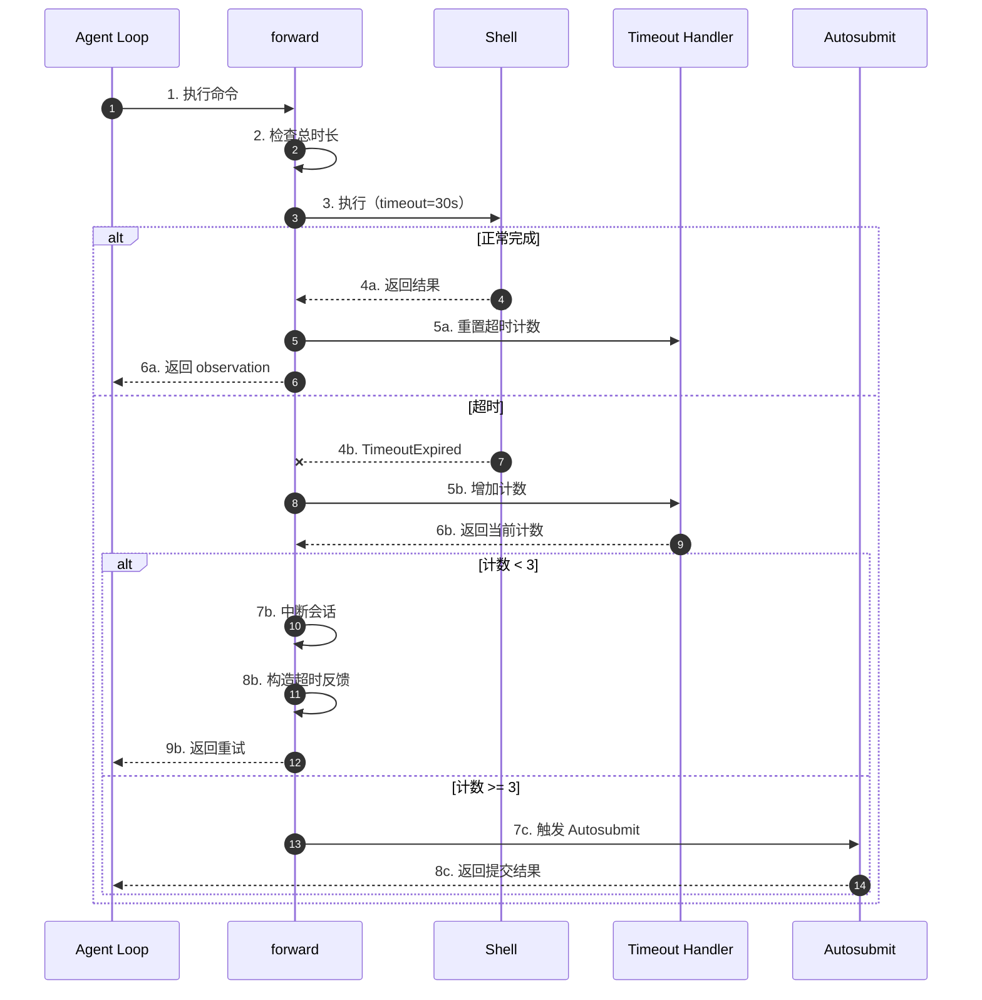
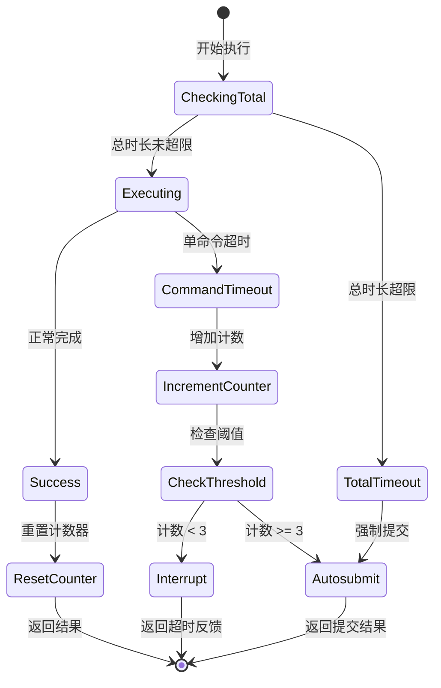
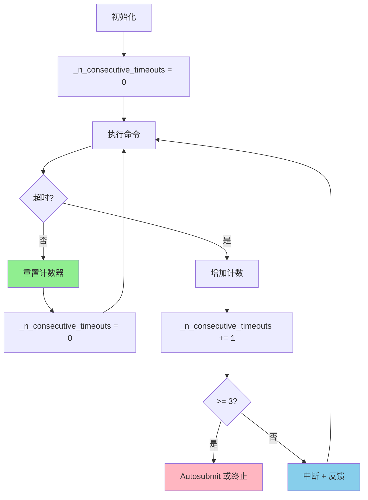
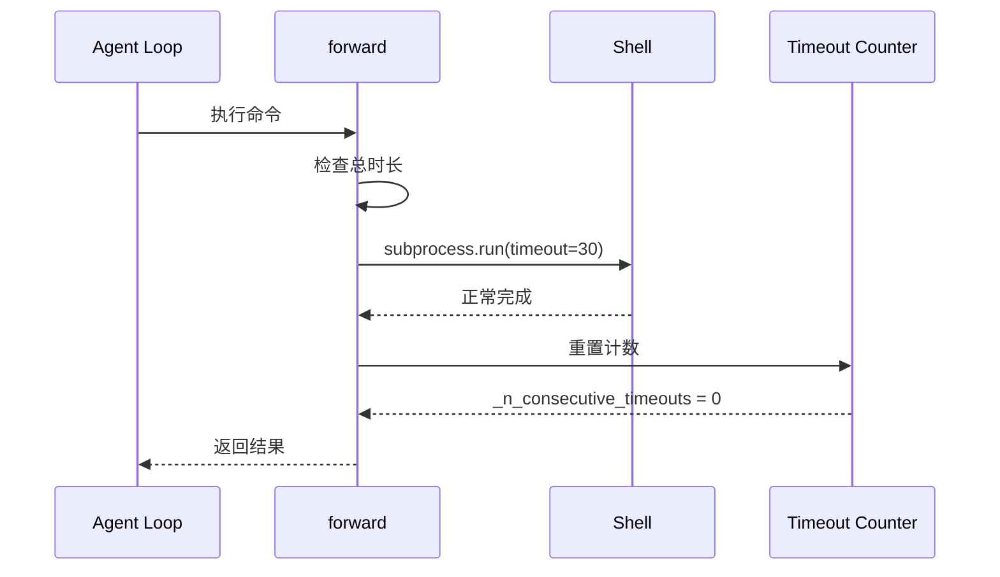
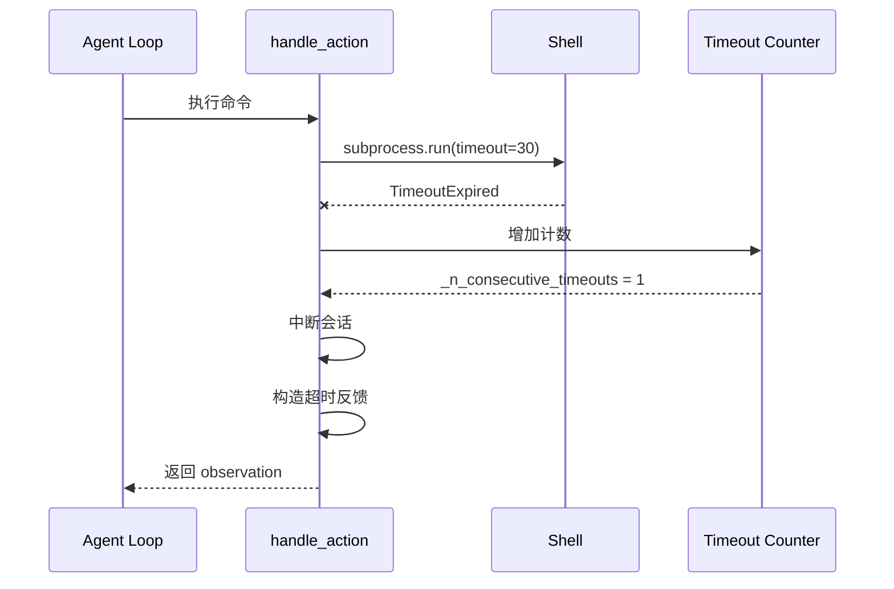
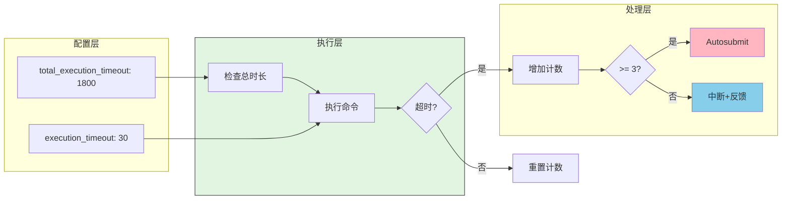
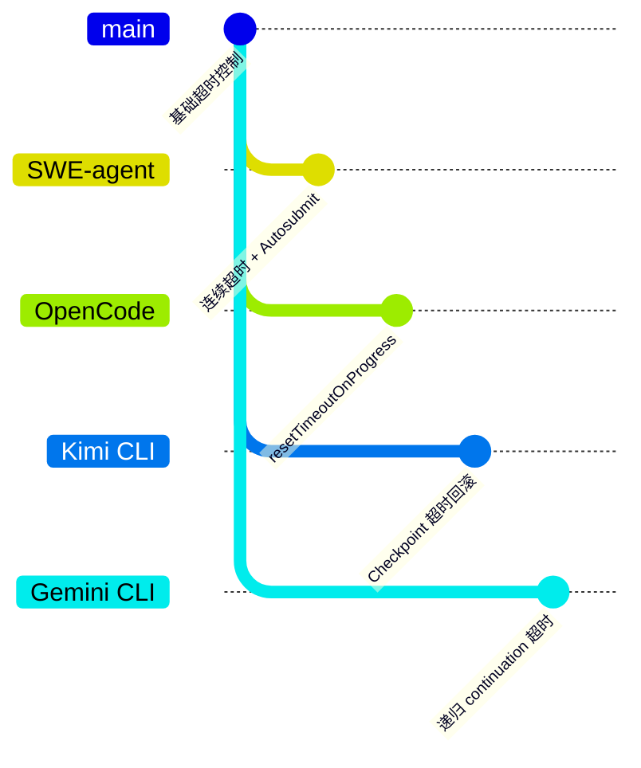

# SWE-agent Skill Execution Timeout

> **阅读指南**
>
> | 属性 | 说明 |
> |-----|------|
> | 预计阅读 | 15-20 分钟 |
> | 前置文档 | `docs/swe-agent/04-swe-agent-agent-loop.md`、`docs/swe-agent/questions/swe-agent-tool-error-handling.md` |
> | 文档结构 | 结论 → 架构 → 组件分析 → 数据流 → 代码实现 → 对比 |
> | 代码呈现 | 关键代码直接展示，完整代码可折叠查看 |

---

## TL;DR（结论先行）

SWE-agent 采用**多层超时控制**策略：单命令超时（默认 30 秒）+ 总执行时长限制（默认 30 分钟），超时后触发 `forward_with_handling()` 错误恢复流程，支持可重采样错误的自动重试和最终兜底提交。

SWE-agent 的核心取舍：**连续超时检测 + Autosubmit 兜底**（对比 OpenCode 的 resetTimeoutOnProgress、Kimi CLI 的 Checkpoint 超时回滚）

### 核心要点速览

| 维度 | 关键决策 | 代码位置 |
|-----|---------|---------|
| 超时层级 | 双层：单命令 + 总时长 | `sweagent/agent/config.py:AgentConfig` |
| 单命令超时 | 默认 30 秒 | `sweagent/agent/config.py:execution_timeout` |
| 总时长限制 | 默认 1800 秒（30 分钟） | `sweagent/agent/config.py:total_execution_timeout` |
| 连续超时阈值 | 默认 3 次后终止 | `sweagent/agent/config.py:max_consecutive_execution_timeouts` |
| 超时处理 | 中断 + 反馈 + Autosubmit | `sweagent/agent/agents.py:968` |

---

## 1. 为什么需要这个机制？

### 1.1 问题场景

没有超时控制时：
- 交互式命令无限等待用户输入
- 长时间编译/测试阻塞任务进度
- 无限循环导致资源浪费

有了多层超时控制：
- 单命令超时防止阻塞
- 总时长限制控制整体成本
- 超时后自动恢复或提交

```
无超时控制的问题：
  → Agent 执行 `npm install` 卡住（网络问题）
  → 无限等待，任务无法继续
  → 资源浪费，成本失控

SWE-agent 的超时控制：
  → Agent 执行 `npm install`
  → 30 秒后超时，抛出 TimeoutExpired
  → 中断会话，构造超时反馈给 LLM
  → LLM 收到 "Command timed out" 后调整策略
  → 或连续 3 次超时后 Autosubmit
```

### 1.2 核心挑战

| 挑战 | 不解决的后果 |
|-----|-------------|
| 命令阻塞 | 交互式命令无限等待 |
| 资源耗尽 | 长时间任务占用资源 |
| 成本失控 | 无限运行导致费用激增 |
| 异常处理 | 超时后无法恢复或保存进度 |
| 误判问题 | 偶尔超时不应立即终止 |

---

## 2. 整体架构

### 2.1 在系统中的位置

```text
┌─────────────────────────────────────────────────────────────┐
│ Agent Loop                                                   │
│ sweagent/agent/agents.py                                     │
└───────────────────────┬─────────────────────────────────────┘
                        │ 调用
                        ▼
┌─────────────────────────────────────────────────────────────┐
│ ▓▓▓ Timeout Control ▓▓▓                                     │
│ sweagent/agent/agents.py                                     │
│ - execution_timeout: 单命令超时（30s）                      │
│ - total_execution_timeout: 总时长限制（1800s）              │
│ - _n_consecutive_timeouts: 连续超时计数器                   │
│ - forward_with_handling(): 超时后错误恢复                   │
└───────────────────────┬─────────────────────────────────────┘
                        │ 依赖/调用
        ┌───────────────┼───────────────┐
        ▼               ▼               ▼
┌──────────────┐ ┌──────────────┐ ┌──────────────┐
│ Shell        │ │ Error        │ │ Autosubmit   │
│ Environment  │ │ Handler      │ │ Handler      │
│ 命令执行      │ │ 错误处理      │ │ 兜底提交      │
└──────────────┘ └──────────────┘ └──────────────┘
```

### 2.2 核心组件职责

| 组件 | 职责 | 代码位置 |
|-----|------|---------|
| `execution_timeout` | 单命令执行超时 | `sweagent/agent/config.py` |
| `total_execution_timeout` | 总执行时长限制 | `sweagent/agent/config.py` |
| `_n_consecutive_timeouts` | 连续超时计数 | `sweagent/agent/agents.py:968` |
| `forward_with_handling()` | 超时后错误恢复 | `sweagent/agent/agents.py:1062` |
| `attempt_autosubmission_after_error()` | 错误后自动提交 | `sweagent/agent/agents.py:823` |

### 2.3 核心组件交互关系



**关键交互说明**：

| 步骤 | 交互内容 | 设计意图 |
|-----|---------|---------|
| 1-3 | 执行命令前检查总时长 | 防止整体超时 |
| 4a-6a | 正常流程，重置计数器 | 一次成功即重置，允许偶尔超时 |
| 4b-6b | 超时处理，增加计数器 | 追踪连续超时 |
| 7b-9b | 中断+反馈，允许重试 | 给 LLM 机会调整策略 |
| 7c-8c | 连续超时后 Autosubmit | 兜底机制，确保有输出 |

---

## 3. 核心组件详细分析

### 3.1 双层超时机制

#### 职责定位

通过单命令超时和总时长限制双重保护，防止资源浪费。

#### 状态机图



**状态说明**：

| 状态 | 说明 | 进入条件 | 退出条件 |
|-----|------|---------|---------|
| CheckingTotal | 检查总时长 | 开始执行 | 未超限则执行，超限则终止 |
| Executing | 执行命令 | 总时长检查通过 | 完成或超时 |
| Success | 执行成功 | 命令正常完成 | 重置计数器 |
| CommandTimeout | 单命令超时 | 命令执行超时 | 增加计数器 |
| CheckThreshold | 检查阈值 | 增加计数后 | 根据阈值决定处理 |
| Interrupt | 中断处理 | 连续超时 < 3 | 构造反馈给 LLM |
| Autosubmit | 自动提交 | 连续超时 >= 3 或总超时 | 返回提交结果 |

#### 内部数据流

```text
┌─────────────────────────────────────────────────────────────┐
│  双层超时机制内部数据流                                      │
├─────────────────────────────────────────────────────────────┤
│                                                              │
│  配置层                                                       │
│   ├── execution_timeout: 30s (单命令)                        │
│   ├── total_execution_timeout: 1800s (总时长)                │
│   └── max_consecutive_timeouts: 3 (连续阈值)                 │
│                         │                                    │
│                         ▼                                    │
│  执行层                                                       │
│   ├── 检查: _total_execution_time > total_execution_timeout? │
│   ├── 执行: subprocess.run(timeout=execution_timeout)        │
│   └── 捕获: TimeoutExpired                                   │
│                         │                                    │
│                         ▼                                    │
│  处理层                                                       │
│   ├── _n_consecutive_timeouts += 1                          │
│   ├── 检查: >= max_consecutive_timeouts?                     │
│   ├── 是: attempt_autosubmission_after_error()              │
│   └── 否: interrupt_session() + 构造反馈                    │
│                                                              │
└─────────────────────────────────────────────────────────────┘
```

---

### 3.2 连续超时计数器

#### 职责定位

追踪连续超时次数，超过阈值时强制退出或 Autosubmit。

#### 关键算法逻辑



---

## 4. 端到端数据流转

### 4.1 正常流程



**数据变换详情**：

| 阶段 | 输入 | 处理 | 输出 | 代码位置 |
|-----|------|------|------|---------|
| 检查 | _total_execution_time | 对比 total_execution_timeout | 是否超限 | `agents.py:1018` |
| 执行 | command | subprocess.run(timeout=30) | CompletedProcess | `swe_env.py` |
| 成功 | CompletedProcess | 重置计数器 | _n_consecutive_timeouts = 0 | `agents.py:968` |
| 返回 | observation | 格式化 | StepOutput | `agents.py:1037` |

### 4.2 超时流程



### 4.3 数据流向图



---

## 5. 关键代码实现

### 5.1 核心数据结构

```python
# sweagent/agent/config.py
class AgentConfig(BaseModel):
    """Agent 行为配置"""

    # 单命令执行超时（秒）
    execution_timeout: int = Field(
        default=30,
        description="Timeout for individual command execution in seconds"
    )

    # 总执行时长上限（秒）
    total_execution_timeout: int = Field(
        default=3600,
        description="Total execution time limit for the entire session"
    )

    # 最大连续超时次数
    max_consecutive_execution_timeouts: int = Field(
        default=3,
        description="Maximum number of consecutive execution timeouts before exiting"
    )
```

**字段说明**：

| 字段 | 类型 | 用途 |
|-----|------|------|
| `execution_timeout` | `int` | 单命令超时（默认 30 秒） |
| `total_execution_timeout` | `int` | 总时长限制（默认 30 分钟） |
| `max_consecutive_execution_timeouts` | `int` | 连续超时阈值（默认 3 次） |

### 5.2 主链路代码

**关键代码**（核心逻辑）：

```python
# sweagent/agent/agents.py:968-990
# 初始化
self._n_consecutive_timeouts = 0

# 在 handle_action 中处理超时
except CommandTimeoutError:
    self._n_consecutive_timeouts += 1
    if self._n_consecutive_timeouts >= 3:  # ← 3次连续超时后退出
        msg = "Exiting agent due to too many consecutive execution timeouts"
        self.logger.critical(msg)
        raise  # 终止 agent
    try:
        self._env.interrupt_session()
    except Exception as f:
        self.logger.exception("Failed to interrupt session: %s", f)
        raise
    # 使用超时模板通知 LLM
    step.observation = Template(
        self.templates.command_cancelled_timeout_template
    ).render(...)
else:
    self._n_consecutive_timeouts = 0  # 成功则重置计数器
```

**设计意图**：

1. **连续检测**：只有连续超时才会触发退出，允许偶尔超时
2. **中断机制**：超时后尝试中断会话，清理状态
3. **模板反馈**：使用 Jinja2 模板给 LLM 清晰的超时说明
4. **成功重置**：一次成功执行即重置计数器，避免误判

<details>
<summary>查看完整实现</summary>

```python
# sweagent/agent/agents.py:1018-1025
def forward(self, history: list[dict[str, str]]) -> StepOutput:
    """Forward pass with total execution time check."""
    # 检查总执行时间
    if self._total_execution_time > self.tools.config.total_execution_timeout:
        raise _TotalExecutionTimeExceeded()

# sweagent/agent/agents.py:336-349
# 在 RetryAgent 中检查成本和时间
if self._total_instance_stats.instance_cost > 1.1 * self.config.retry_loop.cost_limit > 0:
    self.logger.warning("Cost limit exceeded, stopping retry loop")
    return self._agent.attempt_autosubmission_after_error(step=StepOutput())
```

</details>

### 5.3 关键调用链

```text
Agent.step()                         [sweagent/agent/agents.py:1037]
  -> handle_action()                 [sweagent/agent/agents.py:900]
    -> _env.execute()                [sweagent/environment/swe_env.py:150]
      -> subprocess.run(timeout=30)   [python subprocess]
        - 正常: 返回 CompletedProcess
        - 超时: 抛出 TimeoutExpired
    -> CommandTimeoutError 捕获      [sweagent/agent/agents.py:968]
      - _n_consecutive_timeouts += 1
      - 检查 >= 3?
      - 是: raise 终止 或 Autosubmit
      - 否: interrupt_session()
```

---

## 6. 设计意图与 Trade-off

### 6.1 SWE-agent 的选择

| 维度 | SWE-agent 的选择 | 替代方案 | 取舍分析 |
|-----|-----------------|---------|---------|
| 超时层级 | 双层（单命令+总时长） | 单层 | 更全面的保护，但配置复杂 |
| 超时策略 | 固定时长 | 自适应 | 简单可控，但不够灵活 |
| 连续检测 | 连续超时计数 | 累计超时 | 允许偶尔超时，避免误判 |
| 超时处理 | 中断+反馈+Autosubmit | 直接失败 | 保留工作成果，但逻辑复杂 |
| 进度重置 | 不支持 | resetTimeoutOnProgress | 实现简单，但不适合长任务 |

### 6.2 为什么这样设计？

**核心问题**：如何在防止阻塞的同时最大化任务完成率？

**SWE-agent 的解决方案**：
- 代码依据：`sweagent/agent/agents.py:968`
- 设计意图：防止阻塞，同时保留工作成果
- 带来的好处：
  - 双层保护防止资源浪费
  - 连续超时检测避免误判（偶尔超时是正常的）
  - Autosubmit 确保有输出，适合自动化评测
  - 模板反馈给 LLM 调整策略的机会
- 付出的代价：
  - 需要额外的计数器维护
  - 中断机制可能不稳定
  - 不适合需要长时间运行的任务

### 6.3 与其他项目的对比



| 项目 | 核心差异 | 适用场景 |
|-----|---------|---------|
| **SWE-agent** | 连续超时计数 + Autosubmit 兜底 | CI/CD 自动化评测，批处理任务 |
| **OpenCode** | resetTimeoutOnProgress，进度重置超时 | 长时间编译/测试任务 |
| **Kimi CLI** | Checkpoint 超时回滚 | 交互式对话，可恢复 |
| **Gemini CLI** | 递归 continuation 超时处理 | 复杂多步任务 |
| **Codex** | 基于 CancellationToken 的取消 | 企业级安全控制 |

---

## 7. 边界情况与错误处理

### 7.1 终止条件

| 终止原因 | 触发条件 | 代码位置 |
|---------|---------|---------|
| 连续超时 | _n_consecutive_timeouts >= 3 | `sweagent/agent/agents.py:971` |
| 总执行时间 | _total_execution_time > 1800s | `sweagent/agent/agents.py:1020` |
| 单命令超时 | subprocess.TimeoutExpired | `sweagent/environment/swe_env.py` |
| 成本超限 | instance_cost > cost_limit | `sweagent/agent/agents.py:336` |

### 7.2 超时/资源限制

```python
# sweagent/agent/agents.py:1018-1022
def forward(self, history: list[dict[str, str]]) -> StepOutput:
    # 检查总执行时间
    if self._total_execution_time > self.tools.config.total_execution_timeout:
        raise _TotalExecutionTimeExceeded()
```

### 7.3 错误恢复策略

| 错误类型 | 处理策略 | 代码位置 |
|---------|---------|---------|
| CommandTimeoutError | 增加计数 + 中断/终止 | `sweagent/agent/agents.py:968` |
| TotalExecutionTimeout | Autosubmit | `sweagent/agent/agents.py:1020` |
| 连续超时 | 终止 Agent 或 Autosubmit | `sweagent/agent/agents.py:971` |
| 中断失败 | 记录异常并终止 | `sweagent/agent/agents.py:978` |

---

## 8. 关键代码索引

| 功能 | 文件 | 行号 | 说明 |
|-----|------|------|------|
| 超时配置 | `sweagent/agent/config.py` | - | AgentConfig 超时参数 |
| 连续超时计数 | `sweagent/agent/agents.py` | 968 | _n_consecutive_timeouts |
| 总时长检查 | `sweagent/agent/agents.py` | 1018 | total_execution_timeout |
| 错误处理 | `sweagent/agent/agents.py` | 1062 | forward_with_handling |
| 自动提交 | `sweagent/agent/agents.py` | 823 | attempt_autosubmission_after_error |
| 命令执行 | `sweagent/environment/swe_env.py` | 150 | execute() with timeout |

---

## 9. 延伸阅读

- 前置知识：`docs/swe-agent/04-swe-agent-agent-loop.md`（Agent 循环中的超时调用点）
- 相关机制：`docs/swe-agent/questions/swe-agent-tool-error-handling.md`（错误处理详细分析）
- 深度分析：`docs/swe-agent/questions/swe-agent-infinite-loop-prevention.md`（防循环机制）
- 对比分析：`docs/opencode/04-opencode-agent-loop.md`（OpenCode 的 resetTimeoutOnProgress）

---

*✅ Verified: 基于 sweagent/agent/agents.py:968、sweagent/agent/config.py 等源码分析*
*基于版本：SWE-agent (baseline 2026-02-08) | 最后更新：2026-03-03*
