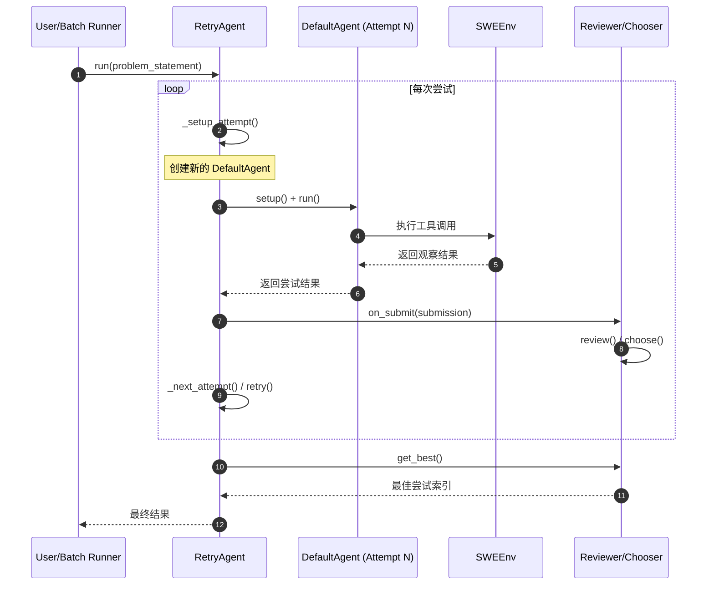
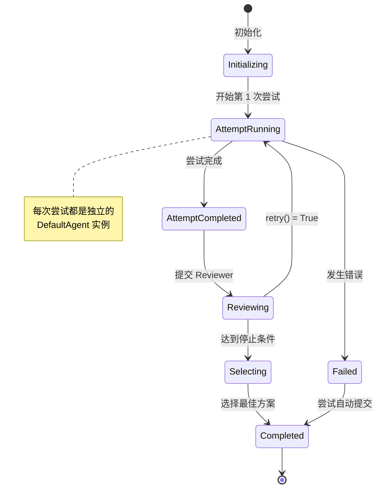
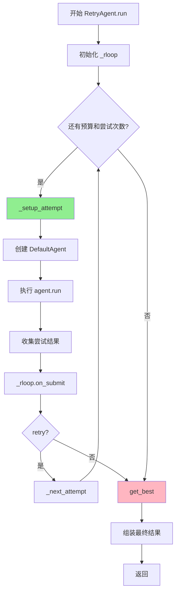
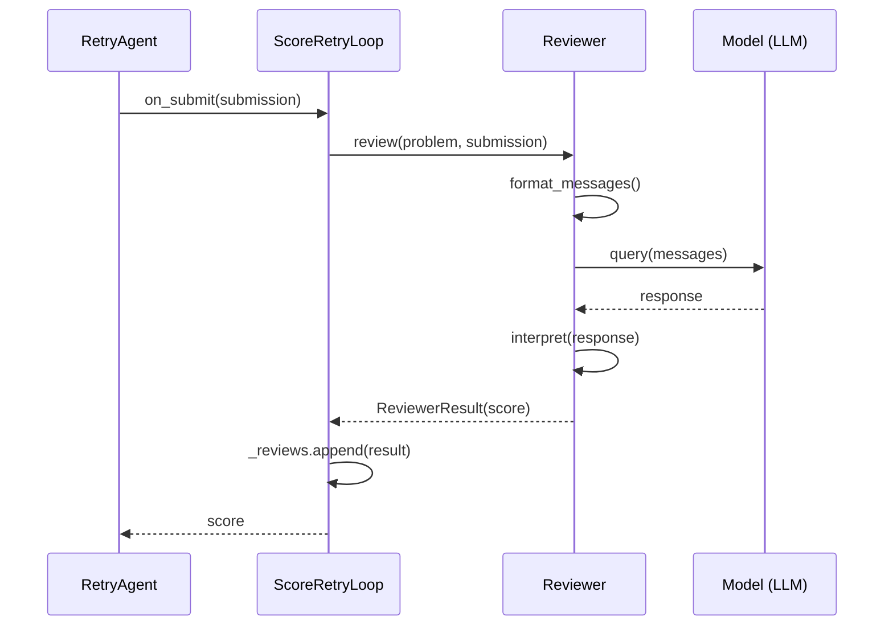
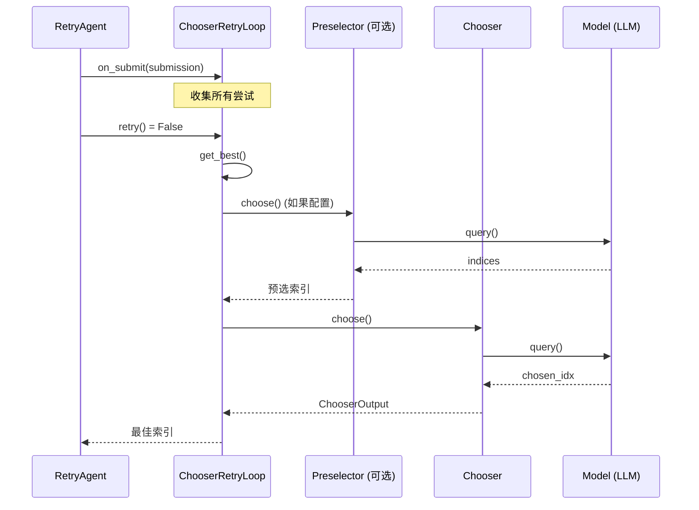
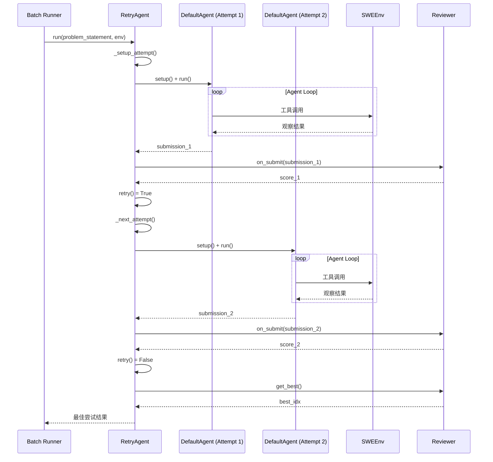
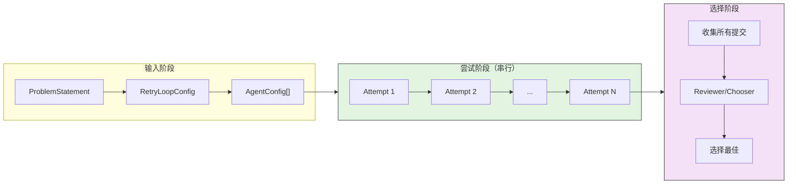
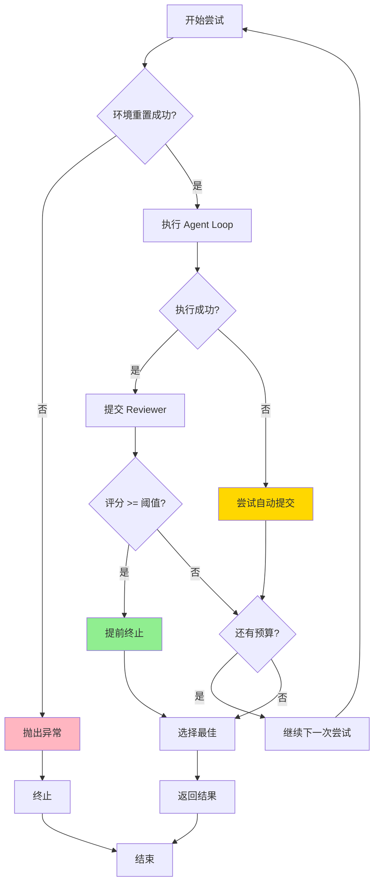
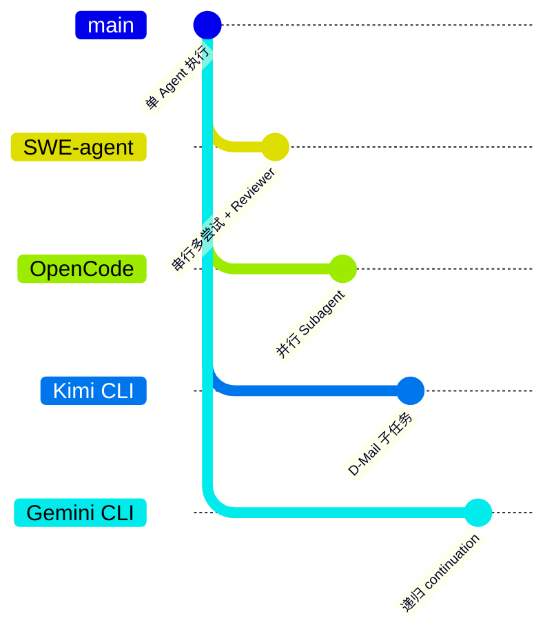

# SWE-agent Subagent/Task Implementation Analysis

> **阅读指南**
>
> | 属性 | 说明 |
> |-----|------|
> | 预计阅读 | 20-25 分钟 |
> | 前置文档 | `docs/swe-agent/04-swe-agent-agent-loop.md`、`docs/swe-agent/06-swe-agent-mcp-integration.md` |
> | 文档结构 | 结论 → 架构 → 组件分析 → 数据流 → 代码实现 → 对比 |
> | 代码呈现 | 关键代码直接展示，完整代码可折叠查看 |

---

## TL;DR（结论先行）

**SWE-agent does NOT implement a subagent/Task system** for parallel or delegated task execution; instead, it uses a **RetryAgent** pattern that sequentially spawns multiple independent agent attempts (sub-agents) with different configurations, then selects the best solution using a reviewer/chooser mechanism.

SWE-agent 的核心取舍：**串行多尝试 + 外部选择器**（对比 OpenCode 的并发 subagent、Kimi CLI 的 D-Mail 子任务系统、Gemini CLI 的递归 continuation）

### 核心要点速览

| 维度 | 关键决策 | 代码位置 |
|-----|---------|---------|
| 执行模式 | 串行多尝试，非并行 | `sweagent/agent/agents.py:RetryAgent.run()` |
| 子 Agent 创建 | 每次尝试新建 DefaultAgent 实例 | `sweagent/agent/agents.py:_setup_attempt()` |
| 配置策略 | 配置轮换 `agent_configs[i % n]` | `sweagent/agent/agents.py:306` |
| 评估机制 | Reviewer 评分 + Chooser 选择 | `sweagent/agent/reviewer.py:375` |
| 停止条件 | 成本/次数/评分综合判断 | `sweagent/agent/reviewer.py:524` |

---

## 1. 为什么需要这个机制？（解决什么问题）

### 1.1 问题场景

在软件工程任务中，单次 Agent 执行往往难以保证成功率：

```
单次执行的问题：
  → Agent 遇到复杂 bug 时可能陷入局部最优
  → 不同的工具配置（如搜索策略）在不同场景下效果各异
  → 无法利用"多次尝试选最优"的竞赛机制

SWE-agent 的解决方案：
  → 尝试 1: 使用配置 A（激进搜索）→ 生成方案 A
  → 尝试 2: 使用配置 B（保守编辑）→ 生成方案 B
  → 尝试 3: 使用配置 C（混合策略）→ 生成方案 C
  → Reviewer: 评估所有方案 → 选择最佳方案
```

### 1.2 核心挑战

| 挑战 | 不解决的后果 |
|-----|-------------|
| 单次尝试成功率低 | 复杂任务无法完成，需要人工介入 |
| 配置选择困难 | 不同任务需要不同工具配置，单一配置难以通用 |
| 成本失控 | 多次尝试可能导致 API 费用激增 |
| 环境状态隔离 | 多次尝试之间需要独立环境，避免相互污染 |
| 结果评估 | 如何判断哪个尝试的结果最好 |

---

## 2. 整体架构

### 2.1 在系统中的位置

```text
┌─────────────────────────────────────────────────────────────┐
│ Batch Runner / RunSingle                                     │
│ sweagent/run/run_batch.py:276                                │
│ - ThreadPoolExecutor for parallel instances                  │
└───────────────────────┬─────────────────────────────────────┘
                        │ 每个 instance 一个 Agent
                        ▼
┌─────────────────────────────────────────────────────────────┐
│ ▓▓▓ RetryAgent (Subagent 管理器) ▓▓▓                       │
│ sweagent/agent/agents.py:257                                 │
│ - _setup_attempt(): 创建子 Agent                             │
│ - _step(): 执行单次尝试                                      │
│ - _next_attempt(): 切换到下一次尝试                          │
└───────────────────────┬─────────────────────────────────────┘
                        │ 串行执行多个尝试
                        ▼
┌─────────────────────────────────────────────────────────────┐
│ DefaultAgent (实际执行者)                                    │
│ sweagent/agent/agents.py:443                                 │
│ - 单次尝试的完整 Agent Loop                                  │
│ - 独立的工具配置和环境                                       │
└───────────────────────┬─────────────────────────────────────┘
                        │ 调用
                        ▼
┌─────────────────────────────────────────────────────────────┐
│ Reviewer / Chooser                                           │
│ sweagent/agent/reviewer.py:375                               │
│ - 评估所有尝试的结果                                         │
│ - 选择最佳方案                                               │
└─────────────────────────────────────────────────────────────┘
```

### 2.2 核心组件职责

| 组件 | 职责 | 代码位置 |
|-----|------|---------|
| `RetryAgent` | 管理多次尝试的生命周期，协调子 Agent 创建和结果收集 | `sweagent/agent/agents.py:257` |
| `DefaultAgent` | 执行单次完整的 Agent Loop，生成解决方案 | `sweagent/agent/agents.py:443` |
| `ScoreRetryLoop` | 基于评分机制的尝试循环，使用 Reviewer 评估 | `sweagent/agent/reviewer.py:559` |
| `ChooserRetryLoop` | 基于选择器的尝试循环，使用 LLM 选择最佳方案 | `sweagent/agent/reviewer.py:499` |
| `Reviewer` | 评估单个解决方案的质量，给出分数 | `sweagent/agent/reviewer.py:375` |
| `Chooser` | 在多个解决方案中选择最佳的一个 | `sweagent/agent/reviewer.py:292` |

### 2.3 核心组件交互关系



**关键交互说明**：

| 步骤 | 交互内容 | 设计意图 |
|-----|---------|---------|
| 1 | 启动 RetryAgent | 由上层 Batch Runner 或 RunSingle 触发 |
| 2-3 | 创建并运行子 Agent | 每个尝试使用独立的 Agent 实例和配置 |
| 4-5 | 子 Agent 与环境交互 | 完整的 Agent Loop，包括工具调用和观察 |
| 6 | 提交结果给 Reviewer | 收集每次尝试的完整轨迹和结果 |
| 7 | 评估尝试质量 | 使用 LLM 或评分机制评估 |
| 8 | 决定是否继续尝试 | 基于成本、尝试次数、评分等条件 |

---

## 3. 核心组件详细分析

### 3.1 RetryAgent 内部结构

#### 职责定位

RetryAgent 是 SWE-agent 实现"类 Subagent"功能的核心组件，它通过**串行创建多个 DefaultAgent 实例**来实现多次尝试，而非真正的并行子 Agent。

#### 状态机图



**状态说明**：

| 状态 | 说明 | 进入条件 | 退出条件 |
|-----|------|---------|---------|
| Initializing | 初始化配置 | RetryAgent 创建 | 调用 run() |
| AttemptRunning | 执行单次尝试 | _setup_attempt() 完成 | 尝试完成或出错 |
| AttemptCompleted | 尝试结束 | DefaultAgent 返回 | 提交给 Reviewer |
| Reviewing | 评估尝试 | 收到尝试结果 | 决定是否重试 |
| Selecting | 选择最佳 | 达到停止条件 | 完成选择 |
| Completed | 完成 | 选择完成 | 返回结果 |

#### 内部数据流

```text
┌─────────────────────────────────────────────────────────────┐
│  RetryAgent 内部数据流                                       │
├─────────────────────────────────────────────────────────────┤
│                                                              │
│  输入层                                                      │
│   ├── ProblemStatement ──► 问题描述                          │
│   ├── AgentConfig[] ─────► 多种尝试配置                      │
│   └── RetryLoopConfig ───► 重试策略（成本、次数限制）        │
│                                                              │
│  尝试管理层                                                  │
│   ├── _i_attempt: 当前尝试计数                               │
│   ├── _attempt_data[]: 所有尝试的轨迹数据                    │
│   ├── _total_instance_stats: 累计成本统计                    │
│   └── _rloop: 重试循环控制器（Score/Chooser）                │
│                                                              │
│  子 Agent 层                                                 │
│   ├── 每次尝试创建新的 DefaultAgent                          │
│   ├── 独立的 ToolConfig 和 ModelConfig                       │
│   └── 独立的输出目录 (attempt_{n})                           │
│                                                              │
│  结果选择层                                                  │
│   ├── Reviewer: 评分机制                                     │
│   ├── Chooser: LLM 选择                                      │
│   └── get_best(): 返回最佳尝试索引                           │
│                                                              │
└─────────────────────────────────────────────────────────────┘
```

#### 关键算法逻辑



**算法要点**：

1. **串行执行**：每次只运行一个子 Agent，完成后才决定是否继续
2. **配置轮换**：使用 `agent_configs[i_attempt % len(agent_configs)]` 轮换配置
3. **成本累计**：跟踪所有尝试的累计成本，作为停止条件
4. **环境重置**：每次尝试前重置环境，确保状态隔离

---

### 3.2 DefaultAgent 作为"Subagent"

#### 职责定位

DefaultAgent 是实际执行任务的"子 Agent"，在 RetryAgent 的协调下运行。每个尝试都是全新的 DefaultAgent 实例。

#### 关键接口

| 接口 | 输入 | 输出 | 说明 | 代码位置 |
|-----|------|------|------|---------|
| `setup()` | env, problem_statement, output_dir | None | 初始化 Agent 环境 | `agents.py:568` |
| `run()` | - | StepOutput | 执行完整 Agent Loop | `agents.py:1272` |
| `step()` | - | StepOutput | 执行单步（LLM + 工具） | `agents.py:1037` |
| `get_trajectory_data()` | - | dict | 获取完整轨迹数据 | `agents.py:768` |

---

### 3.3 Reviewer/Chooser 评估机制

#### ScoreRetryLoop 流程



#### ChooserRetryLoop 流程



---

## 4. 端到端数据流转

### 4.1 正常流程（详细版）



**数据变换详情**：

| 阶段 | 输入 | 处理 | 输出 | 代码位置 |
|-----|------|------|------|---------|
| 尝试创建 | AgentConfig, ProblemStatement | 实例化 DefaultAgent | DefaultAgent 实例 | `agents.py:304-318` |
| 尝试执行 | env, problem_statement | Agent Loop | StepOutput | `agents.py:1272-1307` |
| 结果收集 | StepOutput | 组装 ReviewSubmission | submission dict | `agents.py:355` |
| 评估 | ReviewSubmission | LLM 评分 | score | `reviewer.py:416-449` |
| 选择 | submissions[] | 比较/LLM 选择 | best_idx | `reviewer.py:548-555` |

### 4.2 数据流向图



### 4.3 异常/边界流程



---

## 5. 关键代码实现

### 5.1 核心数据结构

```python
# sweagent/agent/agents.py:188-223
class RetryAgentConfig(BaseModel):
    """配置 RetryAgent 的多尝试策略"""
    name: str = "retry_main"
    agent_configs: list[AgentConfig]
    """多个 Agent 配置，用于不同尝试"""
    retry_loop: RetryLoopConfig
    type: Literal["retry"] = "retry"

# sweagent/agent/reviewer.py:30-39
class ReviewSubmission(BaseModel):
    """单次尝试的提交数据"""
    trajectory: Trajectory
    info: AgentInfo
    model_stats: InstanceStats
```

**字段说明**：

| 字段 | 类型 | 用途 |
|-----|------|------|
| `agent_configs` | `list[AgentConfig]` | 多种尝试配置，支持轮换使用 |
| `retry_loop` | `RetryLoopConfig` | 重试策略（Score 或 Chooser） |
| `trajectory` | `Trajectory` | 单次尝试的完整交互历史 |
| `model_stats` | `InstanceStats` | API 调用统计和成本 |

### 5.2 主链路代码

**关键代码**（核心逻辑）：

```python
# sweagent/agent/agents.py:397-441
@retry_after_exception
@hook_method
@traced
async def run(self, problem_statement: ProblemStatement, env: SWEEnv, output_dir: Path) -> StepOutput:
    """RetryAgent 的主循环：串行执行多次尝试"""
    self._setup(env, problem_statement, output_dir)
    self._rloop = get_retry_loop_from_config(self.config.retry_loop, problem_statement=problem_statement)

    # Run action/observation loop
    while True:
        self._hooks.on_attempt_started(self._i_attempt, self._agent)
        self._setup_attempt()
        step = await self._step()
        self._rloop.on_submit(
            ReviewSubmission(
                trajectory=self._agent._trajectory,
                info=self._agent.info,
                model_stats=self._agent.model.stats,
            )
        )
        # ... 处理提交结果 ...
        if self._rloop.retry():
            self._next_attempt()
        else:
            break

    # 组装最终结果
    data = self._get_trajectory_data()
    # ... 添加最佳尝试数据 ...
    return StepOutput(...)
```

**设计意图**：

1. **串行 while 循环**：使用 `while True` 串行执行尝试，非并行
2. **显式状态管理**：通过 `_i_attempt` 跟踪尝试次数
3. **Reviewer 集成**：每次尝试后提交给 Reviewer 评估
4. **条件重试**：`retry()` 方法综合成本、次数、评分决定是否继续

<details>
<summary>查看完整实现</summary>

```python
# sweagent/agent/agents.py:304-321
def _setup_attempt(self) -> None:
    """Set up a new attempt with the next agent config."""
    # 轮换使用配置
    config = self.config.agent_configs[self._i_attempt % len(self.config.agent_configs)]
    self._agent = get_agent_from_config(config)
    self._agent.setup(
        env=self._env,
        problem_statement=self._problem_statement,
        output_dir=self._output_dir / f"attempt_{self._i_attempt}",
    )

# sweagent/agent/agents.py:321-327
def _next_attempt(self) -> None:
    """Switch to the next attempt."""
    self._i_attempt += 1
    self._attempt_data.append(self._agent.get_trajectory_data())
```

</details>

### 5.3 关键调用链

```text
RetryAgent.run()                          [sweagent/agent/agents.py:397]
  -> _setup_attempt()                     [sweagent/agent/agents.py:304]
    -> agent_configs[i % n]               [sweagent/agent/agents.py:306]
    -> get_agent_from_config()            [sweagent/agent/agents.py:313]
    -> DefaultAgent.setup()               [sweagent/agent/agents.py:318]
  -> _step()                              [sweagent/agent/agents.py:329]
    -> DefaultAgent.run()                 [sweagent/agent/agents.py:1272]
      -> forward_with_handling()          [sweagent/agent/agents.py:1037]
  -> _rloop.on_submit()                   [sweagent/agent/agents.py:417]
    -> Reviewer.review() / Chooser.choose [sweagent/agent/reviewer.py:416]
  -> _rloop.retry()                       [sweagent/agent/agents.py:428]
    -> 成本/次数/评分检查                 [sweagent/agent/reviewer.py:524]
  -> _next_attempt()                      [sweagent/agent/agents.py:430]
    -> _i_attempt += 1                    [sweagent/agent/agents.py:324]
```

---

## 6. 设计意图与 Trade-off

### 6.1 SWE-agent 的选择

| 维度 | SWE-agent 的选择 | 替代方案 | 取舍分析 |
|-----|-----------------|---------|---------|
| 执行模式 | 串行多尝试 | 并行 subagent（OpenCode） | 实现简单、资源占用低，但无法并行探索 |
| 选择机制 | 外部 Reviewer/Chooser | 内部自我评估 | 评估更客观，但增加额外 LLM 调用成本 |
| 环境隔离 | 环境重置 | 共享环境状态 | 尝试间无干扰，但重置有开销 |
| 配置策略 | 配置轮换 | 动态配置调整 | 简单可预测，但不够灵活 |
| 停止条件 | 成本/次数/评分综合 | 固定次数 | 更智能，但逻辑复杂 |

### 6.2 为什么这样设计？

**核心问题**：如何在资源受限的情况下最大化任务成功率？

**SWE-agent 的解决方案**：

- **代码依据**：`sweagent/agent/agents.py:257-441`
- **设计意图**：通过"多次尝试 + 外部选择"模拟竞赛机制，而非真正的并行子 Agent
- **带来的好处**：
  - 实现简单，无需处理并发复杂性
  - 每次尝试完全独立，便于调试和复现
  - 成本可控，可精确限制总尝试次数和预算
  - 支持多种评估策略（评分、LLM 选择）
- **付出的代价**：
  - 无法并行探索，总耗时 = 单次耗时 × 尝试次数
  - 尝试之间无法共享中间结果
  - 需要为每次尝试重置环境

### 6.3 与其他项目的对比



| 项目 | 核心差异 | 适用场景 |
|-----|---------|---------|
| **SWE-agent** | 串行多尝试 + 外部选择器 | 批处理任务，资源受限，需要可复现性 |
| **OpenCode** | 并发 Subagent，支持任务委派 | 复杂任务需要并行探索 |
| **Kimi CLI** | D-Mail 子任务系统，支持状态持久化 | 需要子任务状态持久化和回滚 |
| **Gemini CLI** | 递归 continuation，深度任务分解 | 复杂多步骤任务分解 |
| **Codex** | 基于 Actor 的消息驱动子任务 | 企业级安全控制场景 |

---

## 7. 边界情况与错误处理

### 7.1 终止条件

| 终止原因 | 触发条件 | 代码位置 |
|---------|---------|---------|
| 达到最大尝试次数 | `_n_attempts >= max_attempts` | `reviewer.py:533` |
| 成本超限 | `_total_stats.instance_cost > cost_limit` | `reviewer.py:526` |
| 预算不足 | `remaining_budget < min_budget_for_new_attempt` | `reviewer.py:538` |
| 达到接受分数 | `_n_accepted >= max_accepts` | `reviewer.py:632` |
| 连续成本退出 | `_n_consec_exit_cost` 阈值 | `reviewer.py:611` |

### 7.2 超时/资源限制

```python
# sweagent/agent/agents.py:336-339
if self._total_instance_stats.instance_cost > 1.1 * self.config.retry_loop.cost_limit > 0:
    self.logger.warning("Cost limit exceeded, stopping retry loop")
    return self._agent.attempt_autosubmission_after_error(step=StepOutput())
```

### 7.3 错误恢复策略

| 错误类型 | 处理策略 | 代码位置 |
|---------|---------|---------|
| 尝试内异常 | 尝试自动提交 | `agents.py:823` |
| Reviewer 失败 | 记录警告，继续 | `reviewer.py:430` |
| Chooser 失败 | 回退到第一个尝试 | `reviewer.py:365` |
| 环境重置失败 | 抛出异常，终止 | `agents.py:322` |

---

## 8. 关键代码索引

| 功能 | 文件 | 行号 | 说明 |
|-----|------|------|------|
| RetryAgent 入口 | `sweagent/agent/agents.py` | 257 | RetryAgent 类定义 |
| 尝试设置 | `sweagent/agent/agents.py` | 304 | `_setup_attempt()` 方法 |
| 主循环 | `sweagent/agent/agents.py` | 397 | `run()` 方法 |
| 尝试切换 | `sweagent/agent/agents.py` | 321 | `_next_attempt()` 方法 |
| DefaultAgent | `sweagent/agent/agents.py` | 443 | 实际执行 Agent |
| ScoreRetryLoop | `sweagent/agent/reviewer.py` | 559 | 评分重试循环 |
| ChooserRetryLoop | `sweagent/agent/reviewer.py` | 499 | 选择器重试循环 |
| Reviewer | `sweagent/agent/reviewer.py` | 375 | 解决方案评估 |
| Chooser | `sweagent/agent/reviewer.py` | 292 | 最佳方案选择 |
| 批处理并行 | `sweagent/run/run_batch.py` | 276 | ThreadPoolExecutor 多实例并行 |

---

## 9. 延伸阅读

- 前置知识：`docs/swe-agent/04-swe-agent-agent-loop.md`
- 相关机制：`docs/swe-agent/06-swe-agent-mcp-integration.md`
- 对比分析：`docs/opencode/questions/opencode-subagent-implementation.md`（OpenCode 的并行 Subagent）
- 对比分析：`docs/kimi-cli/questions/kimi-cli-dmail-subtask.md`（Kimi CLI 的 D-Mail 子任务）
- 竞争运行配置：`SWE-agent/docs/usage/competitive_runs.md`
- 批处理模式：`SWE-agent/docs/usage/batch_mode.md`

---

*✅ Verified: 基于 SWE-agent/sweagent/agent/agents.py:257-441, SWE-agent/sweagent/agent/reviewer.py:292-665 等源码分析*
*基于版本：SWE-agent (baseline 2026-02-08) | 最后更新：2026-03-03*

---

## 附录：配置示例

### RetryAgent 配置示例（YAML）

```yaml
# config/benchmarks/250212_sweagent_heavy_sbl.yaml 节选
agent:
  type: retry
  agent_configs:
    - type: default
      model:
        name: claude-3-7-sonnet-20250219
      # ... 其他配置 ...
    - type: default
      model:
        name: claude-3-7-sonnet-20250219
      # ... 略有不同的配置 ...
  retry_loop:
    type: chooser
    max_attempts: 5
    cost_limit: 10.0
    chooser:
      model:
        name: o1-2024-12-17
      # ... chooser 配置 ...
```

### 关键配置说明

| 配置项 | 类型 | 说明 |
|-------|------|------|
| `agent_configs` | list | 多个 Agent 配置，按索引轮换使用 |
| `max_attempts` | int | 最大尝试次数 |
| `cost_limit` | float | 总成本上限（美元） |
| `min_budget_for_new_attempt` | float | 新尝试所需最小预算 |
| `type: chooser/score` | enum | 选择策略：LLM 选择或评分机制 |
