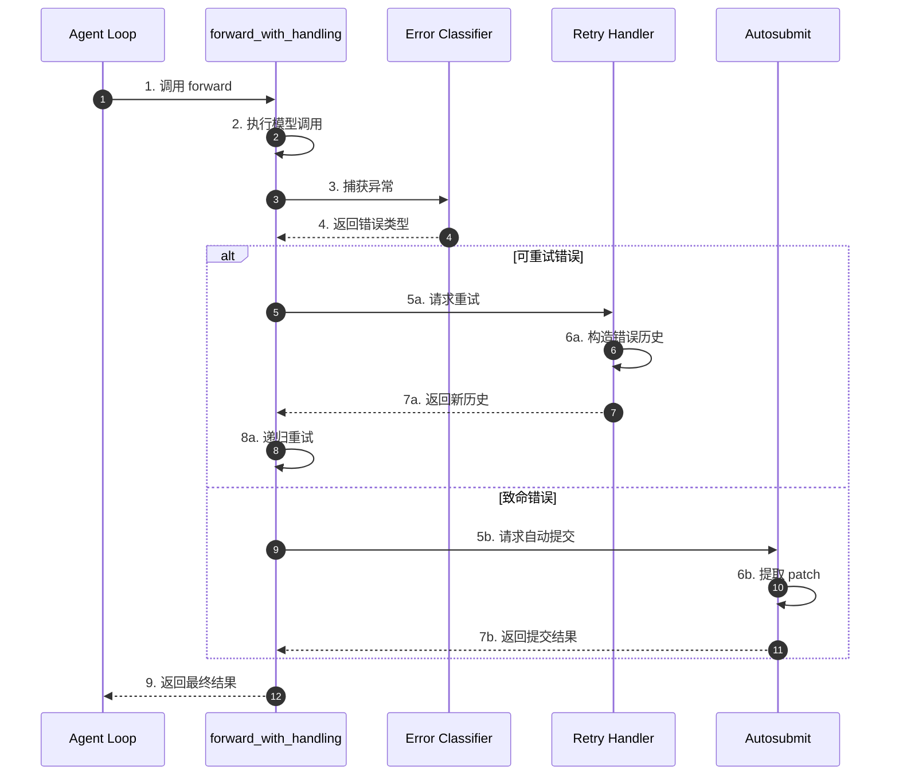
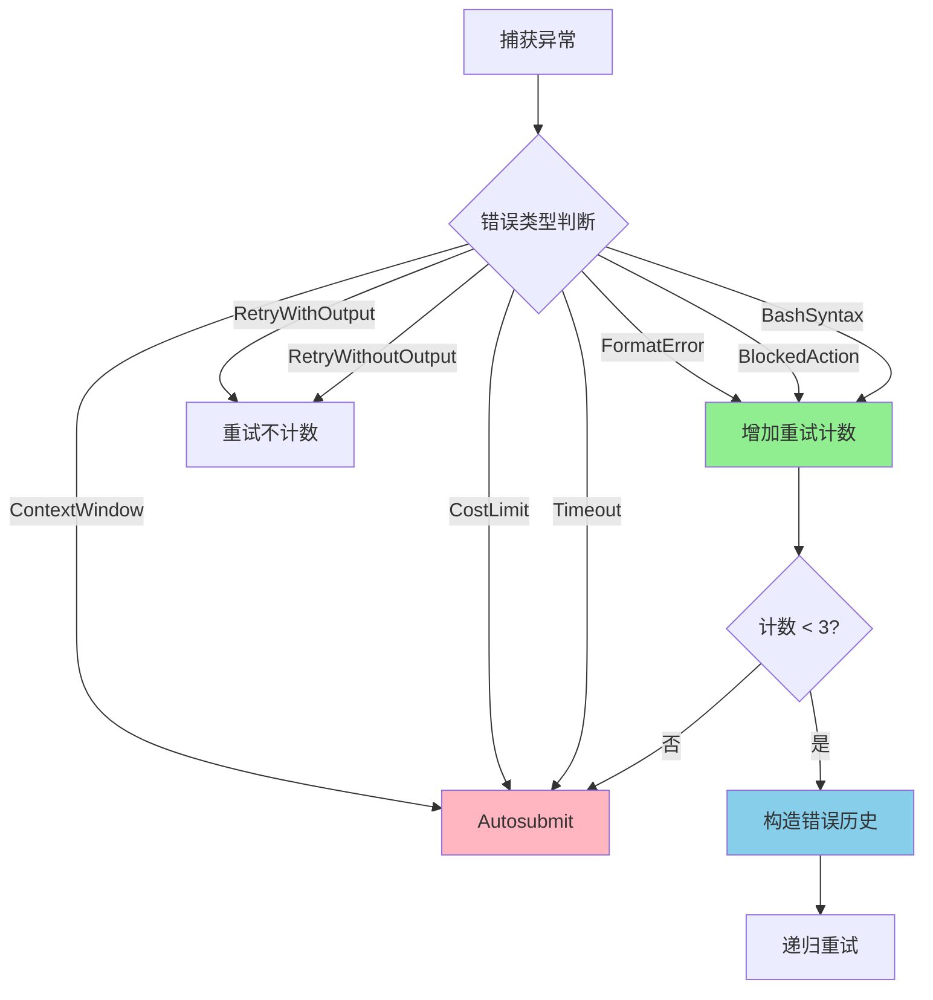
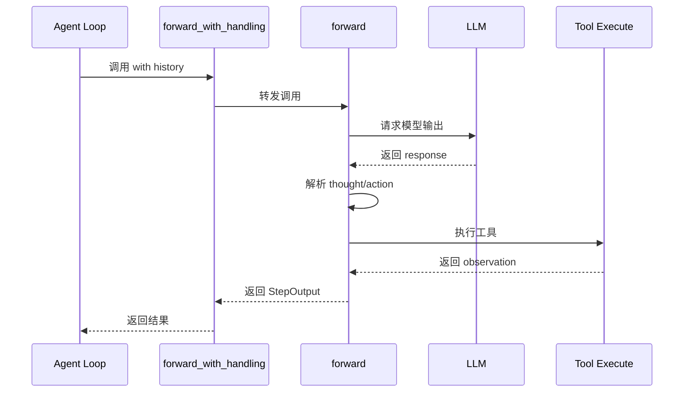
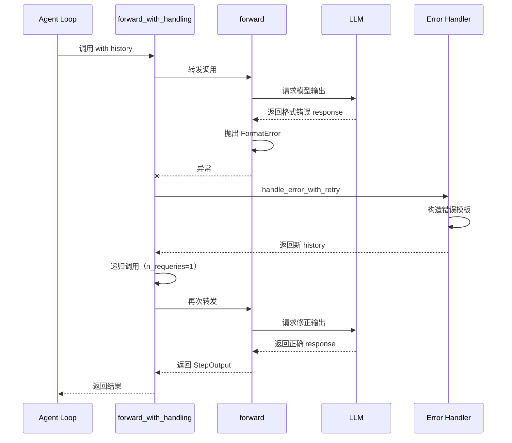
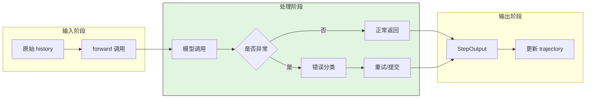

# SWE-agent Tool Error Handling

## TL;DR（结论先行）

SWE-agent 采用**模板化错误反馈 + forward_with_handling() 集中处理 + Autosubmit 自动提交**的架构，通过 `max_requeries=3` 限制格式错误重试次数，并实现 `attempt_autosubmission_after_error()` 在异常情况下自动提取 patch，确保在 CI/CD 场景下的高完成率。

---

## 1. 为什么需要这个机制？

### 1.1 问题场景

没有统一错误处理时：
- LLM 输出格式错误导致整个任务失败
- 环境异常时丢失已做的工作
- 错误信息不清晰，难以自我纠正

有了集中错误处理：
- 格式错误自动重试，提高成功率
- 异常时自动提交 patch，保留工作成果
- 模板化反馈帮助 LLM 理解并修正错误

### 1.2 核心挑战

| 挑战 | 不解决的后果 |
|-----|-------------|
| 格式错误恢复 | 单次格式错误导致任务失败 |
| 环境异常处理 | 环境崩溃时丢失所有进度 |
| 成本控制 | 无限重试导致成本失控 |
| 错误信息质量 | LLM 无法理解错误原因 |

---

## 2. 整体架构

### 2.1 在系统中的位置

```text
┌─────────────────────────────────────────────────────────────┐
│ Agent Loop                                                   │
│ sweagent/agent/agents.py                                     │
└───────────────────────┬─────────────────────────────────────┘
                        │ 调用
                        ▼
┌─────────────────────────────────────────────────────────────┐
│ ▓▓▓ Error Handling ▓▓▓                                      │
│ sweagent/agent/agents.py:1062                                │
│ - forward_with_handling(): 集中错误处理                     │
│ - handle_error_with_retry(): 重试逻辑                       │
│ - attempt_autosubmission_after_error(): 自动提交            │
└───────────────────────┬─────────────────────────────────────┘
                        │ 依赖/调用
        ┌───────────────┼───────────────┐
        ▼               ▼               ▼
┌──────────────┐ ┌──────────────┐ ┌──────────────┐
│ Exception    │ │ Template     │ │ Submission   │
│ Types        │ │ Rendering    │ │ Handler      │
│ 异常类型定义  │ │ 模板渲染     │ │ 提交处理     │
└──────────────┘ └──────────────┘ └──────────────┘
```

### 2.2 核心组件职责

| 组件 | 职责 | 代码位置 |
|-----|------|---------|
| `forward_with_handling()` | 集中错误处理和重试 | `sweagent/agent/agents.py:1062` |
| `handle_error_with_retry()` | 构造重试历史记录 | `sweagent/agent/agents.py:1129` |
| `attempt_autosubmission_after_error()` | 异常时自动提交 | `sweagent/agent/agents.py:823` |
| `TemplateConfig` | 错误模板配置 | `sweagent/agent/agents.py:TemplateConfig` |

### 2.3 核心组件交互关系



---

## 3. 核心组件详细分析

### 3.1 错误类型体系

#### 职责定位

SWE-agent 将错误分为三类：业务异常、控制流异常、环境异常。

#### 错误类型层级图

```text
┌─────────────────────────────────────────────────────────────────┐
│                    SWE-agent 错误类型体系                         │
├─────────────────────────────────────────────────────────────────┤
│                                                                 │
│  业务异常（外部可见）                                              │
│  ├─ FormatError                                                 │
│  │   └─ FunctionCallingFormatError                              │
│  ├─ ContextWindowExceededError                                  │
│  ├─ CostLimitExceededError                                      │
│  │   ├─ InstanceCostLimitExceededError                          │
│  │   ├─ TotalCostLimitExceededError                             │
│  │   └─ InstanceCallLimitExceededError                          │
│  └─ ContentPolicyViolationError                                 │
│                                                                 │
│  控制流异常（内部使用）                                            │
│  ├─ _BlockedActionError                                         │
│  ├─ _RetryWithOutput                                            │
│  ├─ _RetryWithoutOutput                                         │
│  ├─ _ExitForfeit                                                │
│  └─ _TotalExecutionTimeExceeded                                 │
│                                                                 │
│  环境异常（来自 swerex）                                           │
│  ├─ BashIncorrectSyntaxError                                    │
│  ├─ CommandTimeoutError                                         │
│  └─ SwerexException                                             │
│                                                                 │
└─────────────────────────────────────────────────────────────────┘
```

#### 关键算法逻辑



---

### 3.2 forward_with_handling 内部结构

#### 职责定位

集中处理所有模型调用错误，实现统一的重试和恢复策略。

#### 内部数据流

```text
┌─────────────────────────────────────────────────────────────┐
│  输入层                                                      │
│  ├── history: 对话历史                                       │
│  └── max_requeries: 最大重试次数                             │
└──────────────────────────┬──────────────────────────────────┘
                           ▼
┌─────────────────────────────────────────────────────────────┐
│  处理层                                                      │
│  ├── 调用 forward()                                         │
│  ├── 捕获异常                                               │
│  │   └── 分类处理                                           │
│  ├── 可重试错误                                             │
│  │   └── handle_error_with_retry()                          │
│  └── 致命错误                                               │
│      └── attempt_autosubmission_after_error()               │
└──────────────────────────┬──────────────────────────────────┘
                           ▼
┌─────────────────────────────────────────────────────────────┐
│  输出层                                                      │
│  ├── StepOutput: 步骤结果                                   │
│  └── trajectory: 更新执行轨迹                               │
└─────────────────────────────────────────────────────────────┘
```

---

## 4. 端到端数据流转

### 4.1 正常流程



### 4.2 异常流程



### 4.3 数据流向图



---

## 5. 关键代码实现

### 5.1 核心数据结构

```python
# sweagent/exceptions.py
class FormatError(Exception):
    """模型响应无法正确解析为 thought 和 action 时抛出"""

class FunctionCallingFormatError(FormatError):
    """Function calling 解析器使用的格式错误异常"""
    def __init__(
        self,
        message: str,
        error_code: Literal[
            "missing", "multiple", "incorrect_args", "invalid_json",
            "invalid_command", "missing_arg", "unexpected_arg"
        ],
        **extra_info: Any,
    ):
        super().__init__(message + f" [error_code={error_code}]")
        self.message = message
        self.extra_info = {"error_code": error_code, **extra_info}
```

**字段说明**：

| 字段 | 类型 | 用途 |
|-----|------|------|
| `message` | `str` | 错误描述 |
| `error_code` | `Literal` | 错误类型标识 |
| `extra_info` | `dict` | 额外上下文信息 |

### 5.2 主链路代码

```python
# sweagent/agent/agents.py:1062
def forward_with_handling(self, history: list[dict[str, str]]) -> StepOutput:
    """转发模型并处理错误，如果可以则重新查询模型。"""

    def handle_error_with_retry(
        exception: Exception, template: str, n_requeries: int
    ) -> list[dict[str, str]]:
        """如果是格式/阻止列表/bash语法错误，则重新查询模型。"""
        self.logger.warning(
            "Requerying model after %s (%dth requery)",
            type(exception).__name__, n_requeries
        )
        step: StepOutput = getattr(exception, "step", StepOutput())
        self.add_step_to_trajectory(step)
        return self.get_model_requery_history(
            error_template=template,
            **step.to_template_format_dict(),
            exception_message=str(exception),
        )

    n_format_fails = 0
    while n_format_fails < self.max_requeries:
        try:
            return self.forward(history)

        # 可重试错误（增加计数）
        except FormatError as e:
            n_format_fails += 1
            history = handle_error_with_retry(
                exception=e,
                template=self.tools.config.format_error_template,
                n_requeries=n_format_fails
            )
        except _BlockedActionError as e:
            n_format_fails += 1
            history = handle_error_with_retry(...)
        except BashIncorrectSyntaxError as e:
            n_format_fails += 1
            history = handle_error_with_retry(...)

        # 致命错误 → Autosubmit
        except ContextWindowExceededError:
            return handle_error_with_autosubmission("exit_context", "...")
        except CostLimitExceededError:
            return handle_error_with_autosubmission("exit_cost", "...")
```

**代码要点**：

1. **分类处理**：区分可重试错误和致命错误
2. **计数限制**：max_requeries 防止无限重试
3. **模板反馈**：使用 Jinja2 模板给 LLM 清晰的修正指导

### 5.3 关键调用链

```text
Agent.step()                         [sweagent/agent/agents.py:200]
  -> forward_with_handling()         [sweagent/agent/agents.py:1062]
    -> forward()                     [sweagent/agent/agents.py:1018]
      - 模型调用和解析
    -> handle_error_with_retry()     [sweagent/agent/agents.py:1129]
      - 构造错误历史
    -> attempt_autosubmission_after_error() [sweagent/agent/agents.py:823]
      - 提取 patch 并提交
```

---

## 6. 设计意图与 Trade-off

### 6.1 SWE-agent 的选择

| 维度 | SWE-agent 的选择 | 替代方案 | 取舍分析 |
|-----|-----------------|---------|---------|
| 错误处理 | 集中式 forward_with_handling | 分散式 try-catch | 统一策略，便于维护 |
| 重试策略 | 计数限制 + 模板反馈 | 指数退避 | 简单可控，适合 LLM 场景 |
| 异常恢复 | Autosubmit | Checkpoint 回滚 | 保留工作成果，适合 CI/CD |
| 错误反馈 | Jinja2 模板 | 固定字符串 | 灵活可配置，但增加复杂度 |

### 6.2 为什么这样设计？

**核心问题**：如何在保证任务完成率的同时控制成本？

**SWE-agent 的解决方案**：
- 代码依据：`sweagent/agent/agents.py:1062`
- 设计意图："优雅完成"而非"完美完成"
- 带来的好处：
  - 格式错误自动恢复，提高成功率
  - 异常时提交 patch，不浪费已做的工作
  - 模板化反馈帮助 LLM 自我纠正
- 付出的代价：
  - 重试增加成本
  - 自动提交可能包含不完整修复

### 6.3 与其他项目的对比

| 项目 | 核心差异 | 适用场景 |
|-----|---------|---------|
| SWE-agent | Autosubmit + 模板反馈 | CI/CD 自动化，追求完成率 |
| Kimi CLI | Checkpoint + D-Mail 回滚 | 交互式对话，支持用户撤销 |
| Codex | 简单重试，无自动提交 | 企业环境，强调安全性 |
| Gemini CLI | 状态机驱动错误处理 | 复杂任务，需要精细控制 |

---

## 7. 边界情况与错误处理

### 7.1 终止条件

| 终止原因 | 触发条件 | 代码位置 |
|---------|---------|---------|
| 重试耗尽 | n_format_fails >= max_requeries | `sweagent/agent/agents.py:1195` |
| 上下文溢出 | ContextWindowExceededError | `sweagent/agent/agents.py:1176` |
| 成本超限 | CostLimitExceededError | `sweagent/agent/agents.py:1178` |
| 连续超时 | _n_consecutive_timeouts >= 3 | `sweagent/agent/agents.py:971` |

### 7.2 超时/资源限制

```python
# sweagent/agent/agents.py:1018
def forward(self, history: list[dict[str, str]]) -> StepOutput:
    # 检查总执行时间
    if self._total_execution_time > self.tools.config.total_execution_timeout:
        raise _TotalExecutionTimeExceeded()
```

### 7.3 错误恢复策略

| 错误类型 | 处理策略 | 代码位置 |
|---------|---------|---------|
| FormatError | 模板化反馈 + 重试 | `sweagent/agent/agents.py:1153` |
| BashIncorrectSyntaxError | shell 检查反馈 + 重试 | `sweagent/agent/agents.py:1167` |
| CommandTimeoutError | Autosubmit | `sweagent/agent/agents.py:1180` |
| SwerexException | Autosubmit | `sweagent/agent/agents.py:1182` |

---

## 8. 关键代码索引

| 功能 | 文件 | 行号 | 说明 |
|-----|------|------|------|
| 错误类型定义 | `sweagent/exceptions.py` | - | FormatError、CostLimitExceededError 等 |
| 集中错误处理 | `sweagent/agent/agents.py` | 1062 | forward_with_handling() |
| 自动提交 | `sweagent/agent/agents.py` | 823 | attempt_autosubmission_after_error() |
| 错误模板配置 | `sweagent/agent/agents.py` | TemplateConfig | shell_check_error_template 等 |
| 超时配置 | `sweagent/tools/tools.py` | ToolConfig | execution_timeout、total_execution_timeout |

---

## 9. 延伸阅读

- 前置知识：`docs/swe-agent/04-swe-agent-agent-loop.md`（Agent 循环中的错误处理调用点）
- 相关机制：`docs/swe-agent/questions/swe-agent-infinite-loop-prevention.md`（防循环机制）
- 深度分析：`docs/swe-agent/questions/swe-agent-skill-execution-timeout.md`（超时处理详细分析）

---

*✅ Verified: 基于 sweagent/exceptions.py、sweagent/agent/agents.py:1062 等源码分析*
*基于版本：SWE-agent (baseline 2026-02-08) | 最后更新：2026-02-24*
