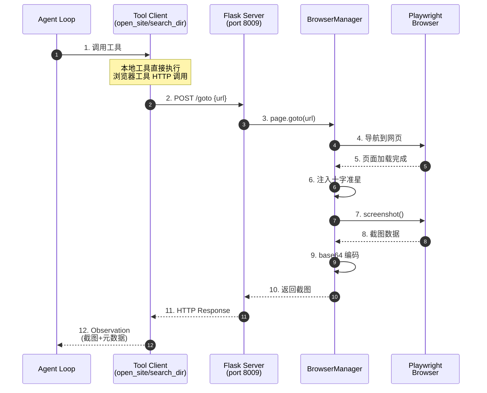
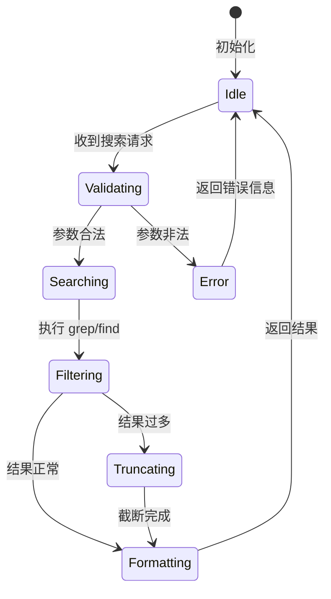
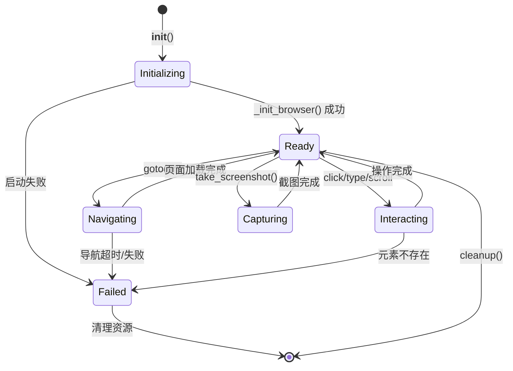
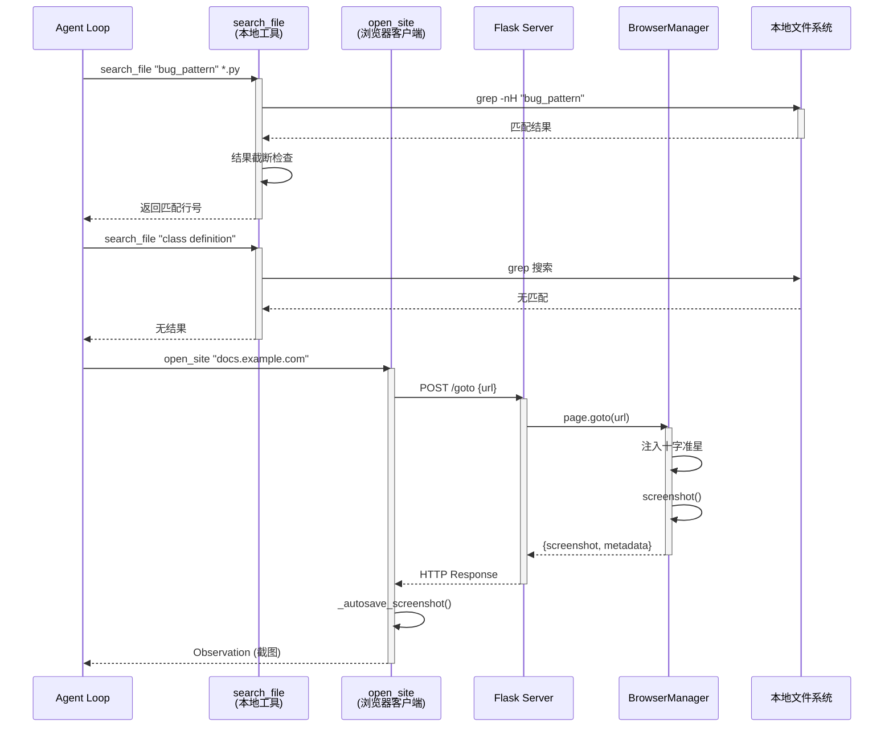
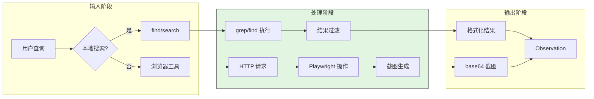
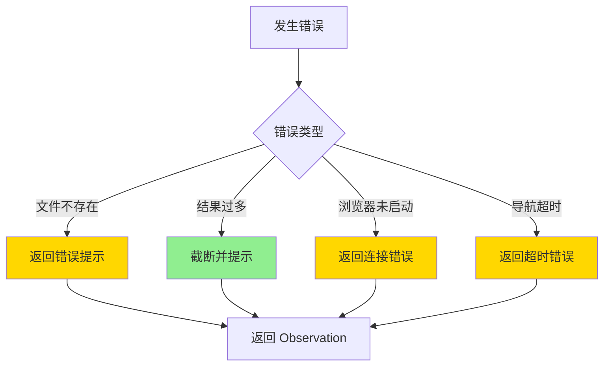
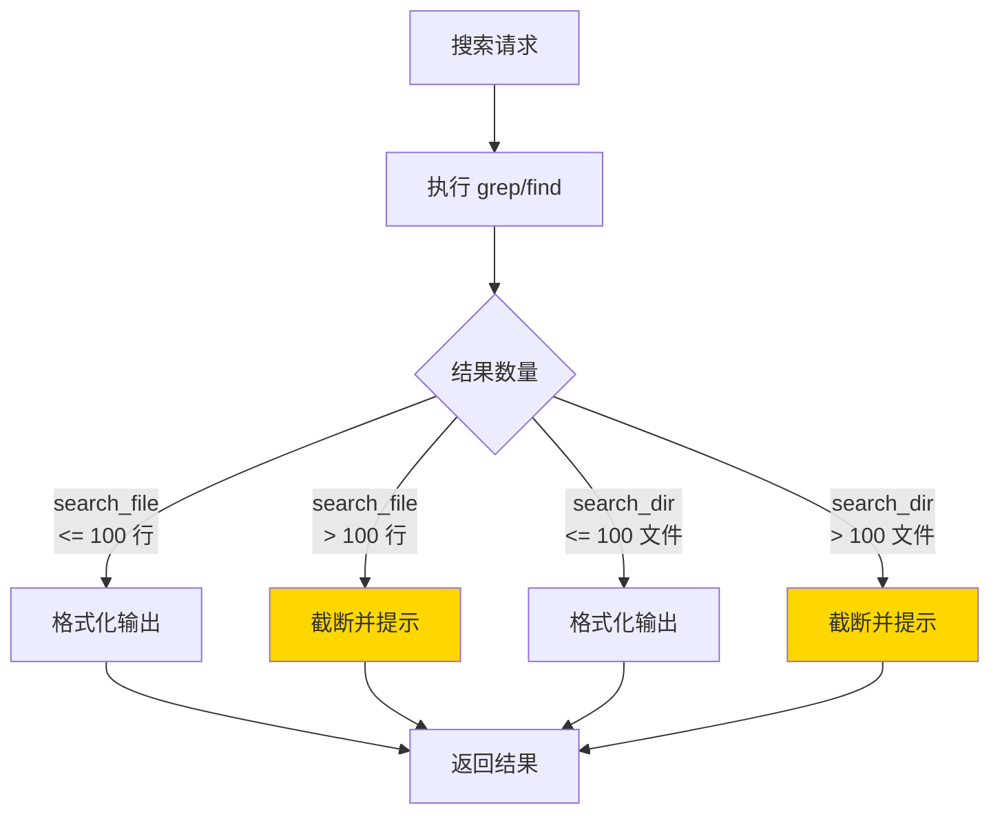
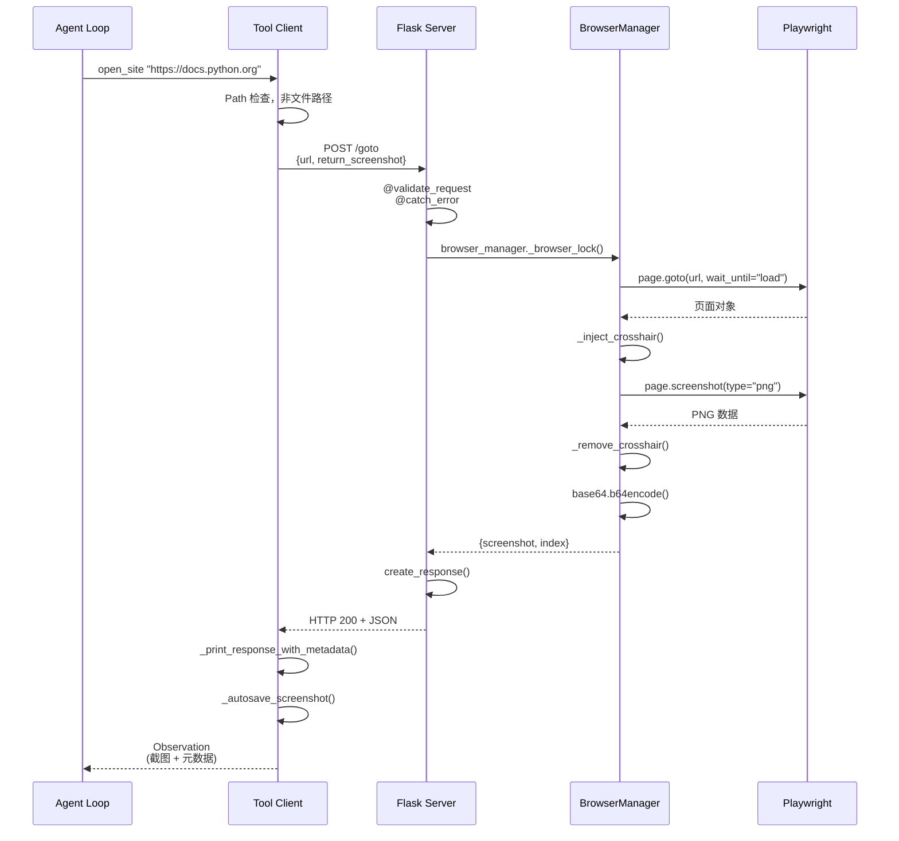
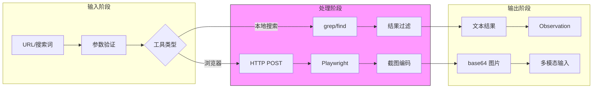
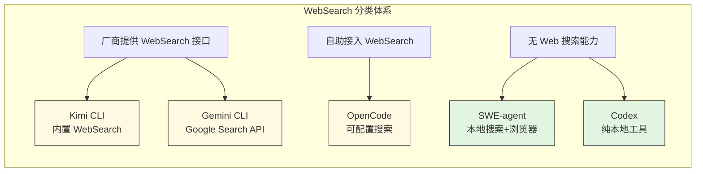

# SWE-agent WebSearch 实现机制

> **阅读指南**
>
> | 属性 | 说明 |
> |-----|------|
> | 预计阅读 | 20-30 分钟 |
> | 前置文档 | `docs/swe-agent/01-swe-agent-overview.md`、`docs/swe-agent/05-swe-agent-tools-system.md` |
> | 文档结构 | 速览 → 架构 → 机制 → 实现 → 对比 |

---

## TL;DR（结论先行）

**一句话定义**：SWE-agent 没有传统 WebSearch API，而是通过**本地代码搜索工具（find_file/search_file/search_dir）+ 浏览器自动化（web_browser）**的组合来支持信息检索需求。

**SWE-agent 的核心取舍**：**本地优先**（代码搜索在本地仓库）+ **浏览器辅助**（需要时手动打开特定网页）（对比 Kimi CLI/Gemini CLI 的直接搜索引擎 API 调用）

### 核心要点速览

| 维度 | 关键决策 | 代码位置 |
|-----|---------|---------|
| 核心机制 | 本地 grep/find 搜索 + Playwright 浏览器自动化 | `tools/search/bin/search_dir:247`、`tools/web_browser/lib/browser_manager.py:141` |
| 状态管理 | BrowserManager 维护 page/mouse_x/mouse_y 状态 | `tools/web_browser/lib/browser_manager.py:317-320` |
| 错误处理 | 结果数量限制（100行/100文件）防止上下文溢出 | `tools/search/bin/search_file:211`、`tools/search/bin/search_dir:258` |
| 架构模式 | Client-Server 架构，Flask HTTP 服务隔离浏览器进程 | `tools/web_browser/bin/run_web_browser_server` |

---

## 1. 为什么需要这个机制？（解决什么问题）

### 1.1 问题场景

在软件工程任务中，Agent 需要频繁地**定位代码**和**查阅文档**：

```
没有搜索工具：
  用户: "修复这个 bug"
  → LLM: "我需要找相关代码... 但不知道文件在哪"
  → 只能盲目猜测，效率低下

有本地搜索工具：
  → LLM: "search_dir 'def process_data' /testbed"
  → 找到 3 个匹配文件
  → LLM: "search_file 'bug_pattern' suspected.py"
  → 精确定位到第 42 行
  → 成功修复

需要外部文档时：
  → LLM: "open_site 'https://docs.python.org/3/library/os.html'"
  → 获取页面截图和文本
  → 查阅特定 API 用法
```

### 1.2 核心挑战

| 挑战 | 不解决的后果 |
|-----|-------------|
| 代码库规模大 | 无法快速定位相关文件，Agent 陷入盲目尝试 |
| 搜索结果过多 | 上下文溢出，token 超限，响应变慢 |
| 外部文档依赖 | 无法获取最新 API 文档，解决方案过时 |
| 浏览器资源管理 | 浏览器进程泄漏，内存占用过高 |

---

## 2. 整体架构

### 2.1 在系统中的位置

```text
┌─────────────────────────────────────────────────────────────┐
│ Agent Loop                                                   │
│ sweagent/agent/agents.py                                     │
└───────────────────────┬─────────────────────────────────────┘
                        │ 调用工具
        ┌───────────────┼───────────────┐
        ▼               ▼               ▼
┌──────────────┐ ┌──────────────┐ ┌──────────────┐
│ 本地搜索工具  │ │ 浏览器工具    │ │ Bash 工具    │
│ find_file    │ │ open_site    │ │ bash         │
│ search_file  │ │ click_mouse  │ │              │
│ search_dir   │ │ screenshot   │ │              │
└──────┬───────┘ └──────┬───────┘ └──────────────┘
       │                │
       ▼                ▼
┌──────────────┐ ┌──────────────────────────────┐
│ grep/find    │ │ Flask Server (port 8009)     │
│ 本地文件系统  │ │  ┌──────────────────────┐   │
└──────────────┘ │  │ Playwright Browser   │   │
                 │  │ - Chromium/Firefox   │   │
                 │  │ - Page/Screenshot    │   │
                 │  └──────────────────────┘   │
                 └──────────────────────────────┘
```

### 2.2 核心组件职责

| 组件 | 职责 | 代码位置 |
|-----|------|---------|
| `find_file` | 按文件名查找文件，支持通配符 | `tools/search/bin/find_file:157` |
| `search_file` | 在指定文件中搜索内容，限制 100 行 | `tools/search/bin/search_file:200` |
| `search_dir` | 递归搜索目录，限制 100 个文件 | `tools/search/bin/search_dir:247` |
| `BrowserManager` | Playwright 浏览器生命周期管理 | `tools/web_browser/lib/browser_manager.py:141` |
| `run_web_browser_server` | Flask HTTP 服务，提供浏览器 API | `tools/web_browser/bin/run_web_browser_server:1` |
| `Bundle` | 工具包加载和配置管理 | `sweagent/tools/bundle.py:415` |

### 2.3 核心组件交互关系



**关键交互说明**：

| 步骤 | 交互内容 | 设计意图 |
|-----|---------|---------|
| 1 | Agent 调用工具 | 统一工具接口，解耦调用与实现 |
| 2 | HTTP POST 请求 | 进程隔离，浏览器服务独立运行 |
| 3-4 | Playwright 导航 | 使用成熟自动化框架，支持多浏览器 |
| 6 | 注入十字准星 | 可视化鼠标位置，辅助多模态模型理解 |
| 7-9 | 截图编码 | base64 嵌入响应，无需额外文件传输 |
| 12 | 返回 Observation | 统一格式，包含截图索引和元数据 |

---

## 3. 核心组件详细分析

### 3.1 本地搜索工具内部结构

#### 职责定位

本地搜索工具提供**零依赖**的代码库检索能力，基于标准 Unix 工具（grep/find）实现。

#### 状态机图



**状态说明**：

| 状态 | 说明 | 进入条件 | 退出条件 |
|-----|------|---------|---------|
| Idle | 空闲等待 | 初始化完成或处理结束 | 收到新请求 |
| Validating | 参数验证 | 收到搜索请求 | 验证通过/失败 |
| Searching | 执行搜索 | 参数合法 | grep/find 完成 |
| Filtering | 结果过滤 | 搜索完成 | 数量检查完成 |
| Truncating | 结果截断 | 超过 100 行/文件 | 截断完成 |
| Formatting | 格式化输出 | 结果就绪 | 格式化完成 |
| Error | 错误状态 | 参数非法或文件不存在 | 返回错误信息 |

#### 内部数据流

```text
┌────────────────────────────────────────────┐
│  输入层                                     │
│   搜索词 → 路径验证 → 参数解析              │
└──────────────────┬─────────────────────────┘
                   ▼
┌────────────────────────────────────────────┐
│  处理层                                     │
│   find/grep 执行 → 结果收集 → 数量检查     │
└──────────────────┬─────────────────────────┘
                   ▼
┌────────────────────────────────────────────┐
│  输出层                                     │
│   结果截断 → 格式化 → 返回 Observation      │
└────────────────────────────────────────────┘
```

#### 关键接口

| 接口 | 输入 | 输出 | 说明 | 代码位置 |
|-----|------|------|------|---------|
| `find_file` | file_name, [dir] | 匹配文件列表 | 按文件名查找 | `tools/search/bin/find_file:139` |
| `search_file` | search_term, [file] | 行号+内容 | 文件内搜索 | `tools/search/bin/search_file:176` |
| `search_dir` | search_term, [dir] | 文件+匹配数 | 目录递归搜索 | `tools/search/bin/search_dir:229` |

---

### 3.2 BrowserManager 内部结构

#### 职责定位

BrowserManager 是 Playwright 浏览器的封装层，负责**浏览器生命周期管理**、**页面状态维护**和**截图生成**。

#### 状态机图



**状态说明**：

| 状态 | 说明 | 进入条件 | 退出条件 |
|-----|------|---------|---------|
| Initializing | 初始化中 | 创建 BrowserManager | 浏览器启动完成/失败 |
| Ready | 就绪状态 | 初始化成功或操作完成 | 收到新指令 |
| Navigating | 页面导航 | 调用 goto() | 加载完成或失败 |
| Interacting | 交互操作 | 点击/输入/滚动 | 操作完成 |
| Capturing | 截图中 | 调用 take_screenshot() | 截图完成 |
| Failed | 失败状态 | 操作出错 | 资源清理 |

#### 内部数据流

```text
┌────────────────────────────────────────────┐
│  输入层                                     │
│   URL/坐标/文本 → HTTP 请求解析            │
└──────────────────┬─────────────────────────┘
                   ▼
┌────────────────────────────────────────────┐
│  Playwright 层                              │
│   page.goto() → page.click() → screenshot  │
└──────────────────┬─────────────────────────┘
                   ▼
┌────────────────────────────────────────────┐
│  输出层                                     │
│   截图编码 → 元数据组装 → JSON 响应        │
└────────────────────────────────────────────┘
```

#### 关键接口

| 接口 | 输入 | 输出 | 说明 | 代码位置 |
|-----|------|------|------|---------|
| `__init__()` | config | BrowserManager | 初始化浏览器 | `tools/web_browser/lib/browser_manager.py:314` |
| `goto()` | url | page 对象 | 导航到 URL | `tools/web_browser/bin/run_web_browser_server:356` |
| `click()` | x, y, button | 成功状态 | 鼠标点击 | `tools/web_browser/bin/run_web_browser_server:367` |
| `take_screenshot()` | - | base64 截图 | 截图生成 | `tools/web_browser/lib/browser_manager.py:333` |

---

### 3.3 组件间协作时序

展示本地搜索与浏览器工具如何协作完成信息检索任务。



**协作要点**：

1. **Agent Loop 与本地工具**：直接进程内调用，低延迟，适合频繁代码搜索
2. **Agent Loop 与浏览器工具**：通过 HTTP 间接调用，进程隔离，防止浏览器崩溃影响主流程
3. **BrowserManager 与 Playwright**：同步 API 调用，简化错误处理

---

### 3.4 关键数据路径

#### 主路径（正常流程）



#### 异常路径（错误恢复）



#### 优化路径（结果限制）



---

## 4. 端到端数据流转

### 4.1 正常流程（详细版）



**数据变换详情**：

| 阶段 | 输入 | 处理 | 输出 | 代码位置 |
|-----|------|------|------|---------|
| 接收 | URL 字符串 | 路径检查、URL 规范化 | 标准化 URL | `tools/web_browser/bin/open_site:393` |
| 验证 | HTTP 请求 | @validate_request 装饰器 | 验证后的参数 | `tools/web_browser/bin/run_web_browser_server:354` |
| 导航 | URL | page.goto() 等待 load 事件 | 页面对象 | `tools/web_browser/bin/run_web_browser_server:360` |
| 截图 | 页面对象 | 注入十字准星 → 截图 → 移除 | PNG 字节 | `tools/web_browser/lib/browser_manager.py:333` |
| 编码 | PNG 字节 | base64.b64encode() | base64 字符串 | `tools/web_browser/lib/browser_manager.py:342` |
| 输出 | 截图数据 | 组装 JSON 响应 | Observation | `tools/web_browser/bin/open_site:403` |

### 4.2 数据流向图



### 4.3 异常/边界流程

```mermaid
flowchart TD
    A[开始] --> B{工具类型}
    B -->|本地搜索| C{文件/目录存在?}
    B -->|浏览器| D{服务器运行?}

    C -->|否| E1[返回"not found"错误]
    C -->|是| F1{结果数量}
    F1 -->|过多| G1[截断并提示缩小范围]
    F1 -->|正常| H1[返回结果]

    D -->|否| E2[返回连接错误]
    D -->|是| F2{URL 合法?}
    F2 -->|否| G2[返回无效 URL 错误]
    F2 -->|是| H2{导航成功?}
    H2 -->|超时| I2[返回超时错误]
    H2 -->|失败| J2[返回导航失败]
    H2 -->|成功| K2[返回截图]

    E1 --> End[结束]
    G1 --> End
    H1 --> End
    E2 --> End
    G2 --> End
    I2 --> End
    J2 --> End
    K2 --> End
```

---

## 5. 关键代码实现

### 5.1 核心数据结构

**工具配置结构（config.yaml）**：

```yaml
# tools/search/config.yaml:1
tools:
  find_file:
    signature: "find_file <file_name> [<dir>]"
    docstring: "finds all files with the given name or pattern in dir..."
    arguments:
      - name: file_name
        type: string
        description: "the name of the file or pattern to search for..."
        required: true
      - name: dir
        type: string
        description: "the directory to search in..."
        required: false

  search_dir:
    signature: "search_dir <search_term> [<dir>]"
    docstring: "searches for search_term in all files in dir..."
    arguments:
      - name: search_term
        type: string
        description: "the term to search for"
        required: true
```

**字段说明**：

| 字段 | 类型 | 用途 |
|-----|------|------|
| `signature` | string | 工具调用签名，用于 Agent 生成正确格式 |
| `docstring` | string | 工具功能描述，帮助 Agent 理解用途 |
| `arguments` | list | 参数定义列表，包含名称、类型、描述、是否必填 |

**BrowserManager 核心属性**：

```python
# tools/web_browser/lib/browser_manager.py:314-324
class BrowserManager:
    def __init__(self):
        self.headless = config.headless  # 默认 True，无头模式
        self.browser_type = self._validate_browser_type(config.browser_type)
        self.page: Page | None = None      # 当前页面对象
        self.screenshot_index = 0          # 截图序号
        self.mouse_x = 0                   # 鼠标 X 坐标
        self.mouse_y = 0                   # 鼠标 Y 坐标
        self._lock = threading.RLock()     # 线程锁
        self.window_width = config.window_width    # 1024
        self.window_height = config.window_height  # 768
        self._init_browser()
```

**字段说明**：

| 字段 | 类型 | 用途 |
|-----|------|------|
| `headless` | bool | 是否无头模式，影响性能和可见性 |
| `page` | Page | Playwright 页面对象，核心操作句柄 |
| `mouse_x/y` | int | 鼠标坐标追踪，用于截图十字准星 |
| `screenshot_index` | int | 截图序号，便于追踪历史 |
| `_lock` | RLock | 线程安全锁，防止并发操作冲突 |

---

### 5.2 主链路代码

**关键代码**（search_dir 核心逻辑）：

```bash
# tools/search/bin/search_dir:229-265
main() {
    # 1. 参数解析
    if [ $# -eq 1 ]; then
        local search_term="$1"
        local dir="./"
    elif [ $# -eq 2 ]; then
        local search_term="$1"
        if [ -d "$2" ]; then
            local dir="$2"
        else
            echo "Directory $2 not found"
            return
        fi
    fi

    dir=$(realpath "$dir")

    # 2. 执行递归搜索，排除隐藏文件
    local matches=$(find "$dir" -type f ! -path '*/.*' -exec grep -nIH -- "$search_term" {} + | cut -d: -f1 | sort | uniq -c)

    if [ -z "$matches" ]; then
        echo "No matches found for \"$search_term\" in $dir"
        return
    fi

    # 3. 结果统计
    local num_matches=$(echo "$matches" | awk '{sum+=$1} END {print sum}')
    local num_files=$(echo "$matches" | wc -l)

    # 4. 数量限制：超过 100 个文件则提示
    if [ $num_files -gt 100 ]; then
        echo "More than $num_files files matched... Please narrow your search."
        return
    fi

    # 5. 格式化输出
    echo "Found $num_matches matches for \"$search_term\" in $dir:"
    echo "$matches" | awk '{$2=$2; gsub(/^\.+/+/, "./", $2); print $2 " ("$1" matches)"}'
}
```

**设计意图**：
1. **参数灵活**：支持 1-2 个参数，省略目录时默认当前目录
2. **隐藏文件排除**：`! -path '*/.*'` 排除 .git 等隐藏目录，减少噪音
3. **数量限制**：100 文件阈值防止上下文溢出，强制 Agent 细化搜索
4. **路径简化**：`gsub(/^\.+/+/, "./", $2)` 简化输出路径，提高可读性

<details>
<summary>查看完整实现（含 search_file）</summary>

```bash
# tools/search/bin/search_file:176-220
main() {
    local search_term="${1:-}"
    if [ -z "${search_term}" ]; then
        echo "Usage: search_file <search_term> [<file>]"
        return
    fi

    if [ $# -ge 2 ]; then
        if [ -f "$2" ]; then
            local file="$2"
        else
            echo "Error: File name $2 not found."
            return
        fi
    else
        # 从环境变量获取当前文件
        local CURRENT_FILE=$(_read_env CURRENT_FILE)
        if [ -z "${CURRENT_FILE:-}" ]; then
            echo "No file open. Use the open command first."
            return
        fi
        local file="$CURRENT_FILE"
    fi

    file=$(realpath "$file")
    local matches=$(grep -nH -- "$search_term" "$file")

    if [ -z "${matches:-}" ]; then
        echo "No matches found for \"$search_term\" in $file"
        return
    fi

    local num_matches=$(echo "$matches" | wc -l | awk '{$1=$1; print $0}')
    local num_lines=$(echo "$matches" | cut -d: -f1 | sort | uniq | wc -l)

    # 限制：超过 100 行匹配则提示
    if [ $num_lines -gt 100 ]; then
        echo "More than $num_lines lines matched... Please narrow your search."
        return
    fi

    echo "Found $num_matches matches for \"$search_term\" in $file:"
    echo "$matches" | cut -d: -f1-2 | sort -u -t: -k2,2n | while IFS=: read -r filename line_number; do
        echo "Line $line_number:$(sed -n "${line_number}p" "$file")"
    done
}
```

</details>

**关键代码**（BrowserManager 截图实现）：

```python
# tools/web_browser/lib/browser_manager.py:333-350
def take_screenshot(self) -> dict[str, Any]:
    """Capture screenshot with crosshair."""
    with self._browser_lock() as page:
        # 1. 注入红色十字准星显示鼠标位置
        self._inject_crosshair(page, self.mouse_x, self.mouse_y)
        time.sleep(self.screenshot_delay)

        # 2. 执行截图
        screenshot_data = page.screenshot(type="png")

        # 3. 清理准星
        self._remove_crosshair(page)

        # 4. 编码并返回
        return {
            "screenshot": base64.b64encode(screenshot_data).decode(),
            "screenshot_index": self.screenshot_index,
        }
```

**设计意图**：
1. **十字准星注入**：可视化鼠标位置，帮助多模态模型理解交互点
2. **延迟等待**：`screenshot_delay` 确保页面渲染完成
3. **base64 编码**：内嵌到 JSON 响应，无需额外文件传输
4. **索引追踪**：`screenshot_index` 便于调试和审计

<details>
<summary>查看完整实现（含 Flask Server 端点）</summary>

```python
# tools/web_browser/bin/run_web_browser_server:354-383
@app.route("/goto", methods=["POST"])
@validate_request("url", "return_screenshot")
@catch_error
def goto():
    url = normalize_url(request.json["url"])
    return_screenshot = request.json["return_screenshot"]
    with browser_manager._browser_lock() as page:
        page.goto(url, wait_until="load")
        data = {"status": "success", "message": f"Navigated to {url}"}
        return create_response(data, return_screenshot)

@app.route("/click", methods=["POST"])
@validate_request("x", "y", "button", "return_screenshot")
@catch_error
@require_website_open
def click():
    x, y = round(request.json["x"]), round(request.json["y"])
    button = request.json["button"]
    return_screenshot = request.json["return_screenshot"]
    with browser_manager._browser_lock() as page:
        page.mouse.click(x, y, button=button)
        browser_manager.mouse_x, browser_manager.mouse_y = x, y
        data = {"status": "success", "message": f"Clicked '{button}' at ({x},{y})"}
        return create_response(data, return_screenshot)

@app.route("/screenshot", methods=["GET"])
@require_website_open
def screenshot():
    data = {"status": "success", "message": "Screenshot"}
    return create_response(data, True)
```

</details>

---

### 5.3 关键调用链

**本地搜索调用链**：

```text
Agent Loop
  -> execute_tool("search_dir", ["pattern", "/testbed"])
     [sweagent/agent/agents.py:execute_action]
    -> Tool.run()
       [sweagent/tools/tools.py:run]
      -> subprocess.run(["search_dir", "pattern", "/testbed"], ...)
         [sweagent/tools/tools.py:execute]
        -> tools/search/bin/search_dir
           - 参数解析
           - find ... -exec grep ...
           - 结果截断检查
           - 格式化输出
```

**浏览器工具调用链**：

```text
Agent Loop
  -> execute_tool("open_site", ["https://docs.python.org"])
     [sweagent/agent/agents.py:execute_action]
    -> open_site.main()
       [tools/web_browser/bin/open_site:391]
      -> send_request(port, "goto", "POST", {url, return_screenshot})
         [tools/web_browser/lib/client.py]
        -> HTTP POST http://localhost:8009/goto
           [tools/web_browser/bin/run_web_browser_server:354]
          -> @validate_request
             @catch_error
          -> browser_manager._browser_lock()
             [tools/web_browser/lib/browser_manager.py:333]
            -> page.goto(url, wait_until="load")
               [playwright/sync_api.py]
            -> _inject_crosshair()
            -> page.screenshot(type="png")
            -> base64.b64encode()
          -> create_response(data, return_screenshot)
        <- HTTP Response (JSON)
      -> _print_response_with_metadata()
      -> _autosave_screenshot_from_response()
```

---

## 6. 设计意图与 Trade-off

### 6.1 SWE-agent 的选择

| 维度 | SWE-agent 的选择 | 替代方案 | 取舍分析 |
|-----|-----------------|---------|---------|
| 搜索范围 | 本地代码库优先 | 互联网搜索 API | 零成本、低延迟、离线可用，但无法获取外部信息 |
| 搜索工具 | grep/find Bash 脚本 | Python 实现/索引服务 | 简单可靠、零依赖，但功能有限、无智能排序 |
| 浏览器架构 | Client-Server (HTTP) | 进程内直接调用 | 进程隔离、崩溃不影响主流程，但增加复杂度和延迟 |
| 结果处理 | 硬编码数量限制 (100) | 智能摘要/向量检索 | 实现简单、确定性强，但可能丢失重要信息 |
| 截图反馈 | 每次操作返回截图 | 按需截图/文本提取 | 多模态友好、交互可视化，但增加带宽和存储 |

### 6.2 为什么这样设计？

**核心问题**：如何在软件工程任务中高效地支持代码定位和文档查阅？

**SWE-agent 的解决方案**：
- **代码依据**：`tools/search/bin/search_dir:247`、`tools/web_browser/lib/browser_manager.py:141`
- **设计意图**：
  1. **专注代码库**：SWE-agent 定位是修复代码问题，而非通用问答
  2. **零外部依赖**：不依赖搜索引擎 API，避免成本和可用性问题
  3. **确定性输出**：grep/find 结果可预期，便于 Agent 规划
  4. **模块化扩展**：浏览器工具按需加载，不强制启用
- **带来的好处**：
  - 离线可用，适合私有代码库
  - 零 API 成本
  - 本地搜索延迟极低（毫秒级）
  - 浏览器工具提供完整网页交互能力
- **付出的代价**：
  - 无法自动获取互联网最新信息
  - 搜索结果无智能排序
  - 浏览器工具需要额外配置和启动

### 6.3 与其他项目的对比



| 项目 | WebSearch 分类 | 实现方式 | 核心差异 | 适用场景 |
|-----|---------------|---------|---------|---------|
| **SWE-agent** | 无 Web 搜索能力 | 本地搜索 + 浏览器自动化 | 无搜索引擎 API，依赖 Playwright 浏览器访问特定网页 | 私有代码库、离线环境、代码定位任务 |
| **Kimi CLI** | 厂商提供 WebSearch 接口 | 内置 WebSearch 工具 | 调用外部搜索服务，自动总结结果 | 需要外部文档、解决方案搜索 |
| **Gemini CLI** | 厂商提供 WebSearch 接口 | Google Search API | 原生集成 Google 搜索，结果结构化 | 互联网信息检索、事实核查 |
| **OpenCode** | 自助接入 WebSearch | 可配置 WebSearch | 支持多种搜索提供商，灵活配置 | 企业环境、自定义搜索后端 |
| **Codex** | 无 Web 搜索能力 | 无内置 WebSearch | 依赖外部工具或 MCP 扩展 | 纯代码任务、安全敏感环境 |

**分类说明**：

| 分类 | 定义 | 代表项目 |
|-----|------|---------|
| **厂商提供 WebSearch 接口** | LLM 厂商直接提供搜索能力，Agent 通过调用厂商 API 获取搜索结果 | Kimi CLI、Gemini CLI |
| **自助接入 WebSearch** | Agent 开发者自行接入第三方搜索服务（如 SerpAPI、Bing Search API 等） | OpenCode |
| **无 Web 搜索能力** | 不具备网络搜索功能，只使用本地工具（如代码搜索、Playwright 浏览器自动化） | SWE-agent、Codex |

**关键差异分析**：

| 对比维度 | SWE-agent | Kimi/Gemini CLI |
|---------|-----------|-----------------|
| 搜索触发 | Agent 主动调用工具 | 系统自动识别需求 |
| 搜索范围 | 本地代码库 + 指定网页 | 整个互联网 |
| 结果形式 | 文件路径/代码行/网页截图 | 文本摘要 |
| 成本 | 零 API 费用 | 可能产生搜索费用 |
| 延迟 | 本地毫秒级 | 网络请求秒级 |
| 离线可用 | 是 | 否 |

---

## 7. 边界情况与错误处理

### 7.1 终止条件

| 终止原因 | 触发条件 | 代码位置 |
|---------|---------|---------|
| 文件不存在 | search_file 指定的文件不存在 | `tools/search/bin/search_file:184` |
| 目录不存在 | find_file/search_dir 指定的目录不存在 | `tools/search/bin/find_file:148`、`tools/search/bin/search_dir:238` |
| 无匹配结果 | grep/find 返回空 | `tools/search/bin/search_file:202`、`tools/search/bin/search_dir:249` |
| 结果过多 | 超过 100 行（search_file）或 100 文件（search_dir） | `tools/search/bin/search_file:211`、`tools/search/bin/search_dir:258` |
| 浏览器未启动 | 无法连接到 Flask Server | `tools/web_browser/lib/client.py` (推断) |
| 导航超时 | page.goto() 超过超时时间 | Playwright 默认超时 |

### 7.2 超时/资源限制

```python
# tools/web_browser/lib/browser_manager.py:314-324
class BrowserManager:
    def __init__(self):
        self.headless = config.headless  # 控制资源占用
        self.window_width = config.window_width    # 1024
        self.window_height = config.window_height  # 768
        # Playwright 默认超时 30s
```

```bash
# tools/search/bin/search_file:211-214
# 硬编码限制：超过 100 行匹配则提示
if [ $num_lines -gt 100 ]; then
    echo "More than $num_lines lines matched... Please narrow your search."
    return
fi
```

### 7.3 错误恢复策略

| 错误类型 | 处理策略 | 代码位置 |
|---------|---------|---------|
| 文件/目录不存在 | 返回明确错误信息，不抛出异常 | `tools/search/bin/find_file:148` |
| 搜索结果过多 | 截断并提示用户细化搜索词 | `tools/search/bin/search_dir:258` |
| 浏览器连接失败 | 返回错误 Observation，Agent 可重试 | 推断 |
| 页面导航超时 | Playwright 自动抛出 TimeoutError | Playwright 内部 |
| 截图失败 | 返回错误状态，附带错误信息 | `tools/web_browser/lib/browser_manager.py:333` |

---

## 8. 关键代码索引

| 功能 | 文件 | 行号 | 说明 |
|-----|------|------|------|
| **本地搜索工具** | | | |
| find_file 实现 | `tools/search/bin/find_file` | 139-167 | 按文件名查找，支持通配符 |
| search_file 实现 | `tools/search/bin/search_file` | 176-220 | 文件内搜索，限制 100 行 |
| search_dir 实现 | `tools/search/bin/search_dir` | 229-265 | 目录递归搜索，限制 100 文件 |
| 工具配置 | `tools/search/config.yaml` | 1-50 | 工具签名和参数定义 |
| **浏览器工具** | | | |
| BrowserManager 类 | `tools/web_browser/lib/browser_manager.py` | 141-350 | Playwright 浏览器管理 |
| 初始化 | `tools/web_browser/lib/browser_manager.py` | 314-324 | 配置加载和浏览器启动 |
| 截图方法 | `tools/web_browser/lib/browser_manager.py` | 333-350 | 截图 + 十字准星 |
| Flask Server | `tools/web_browser/bin/run_web_browser_server` | 1-400+ | HTTP API 服务端 |
| goto 端点 | `tools/web_browser/bin/run_web_browser_server` | 354-362 | 页面导航 |
| click 端点 | `tools/web_browser/bin/run_web_browser_server` | 364-376 | 鼠标点击 |
| open_site 客户端 | `tools/web_browser/bin/open_site` | 391-405 | 打开网站入口 |
| **工具系统** | | | |
| Bundle 类 | `sweagent/tools/bundle.py` | 415-450 | 工具包加载 |
| 工具注册 | `sweagent/tools/bundle.py` | 422-428 | 从 config.yaml 加载工具 |
| Agent 工具调用 | `sweagent/agent/agents.py` | (推断) | execute_action 方法 |

---

## 9. 延伸阅读

- **前置知识**：
  - `docs/swe-agent/01-swe-agent-overview.md` - SWE-agent 整体架构
  - `docs/swe-agent/05-swe-agent-tools-system.md` - 工具系统详解
- **相关机制**：
  - `docs/kimi-cli/06-kimi-cli-mcp-integration.md` - Kimi CLI 的 WebSearch 实现对比
  - `docs/gemini-cli/06-gemini-cli-mcp-integration.md` - Gemini CLI 搜索集成
- **深度分析**：
  - `docs/comm/comm-tools-system.md` - 跨项目工具系统对比
  - `docs/comm/comm-mcp-integration.md` - MCP 集成模式对比

---

*✅ Verified: 基于 SWE-agent/tools/search/bin/search_dir:247、tools/web_browser/lib/browser_manager.py:141 等源码分析*
*基于版本：2026-02-08 | 最后更新：2026-04-12*
